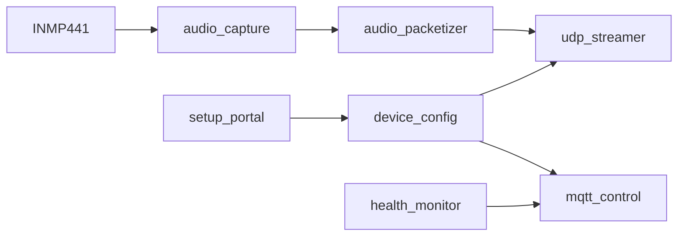

# Mic-ESP32

> `ESP32-S3` microphone node firmware for the Event-Triggered Audio Replay Agent.

中文说明见：[README.zh-CN.md](README.zh-CN.md)

## Firmware Flow



## What The Node Does

- captures `I2S` audio from `INMP441`
- frames `16 kHz / 16-bit / mono PCM`
- sends audio to the PC hub over UDP
- exposes telemetry and control over MQTT
- stores runtime config in NVS
- serves a web setup portal in AP mode and a local reconfiguration page in STA mode

## Provisioning Lifecycle

### First boot

If the node has no valid runtime configuration, it starts:

- Wi-Fi AP `MicSetup-<last6>`
- HTTP setup page at `http://192.168.4.1/`

The user fills:

- Wi-Fi SSID and password
- MQTT host, port, username, and password
- UDP host and port
- `node_id`

After save, the device writes config to NVS and reboots into normal STA mode.

### Normal operation

Once the node joins your router, the same config form remains available on the local device IP for reconfiguration.

### Forced recovery

If you need to force AP setup again:

- hold the dedicated setup button low for 5 seconds during boot
- default recovery pin is `GPIO9` via `CONFIG_MIC_SETUP_BUTTON_GPIO`
- do not reuse `GPIO0` for this purpose on ESP32-S3 boards

## Identity Model

- `node_uuid`
  derived from the ESP32-S3 STA MAC and used as the stable backend and MQTT key
- `node_id`
  human-readable label that can be renamed independently

## Build Inputs

### Optional compile-time secrets

Create `main/device_secrets.h` from `main/device_secrets.h.example` if you want embedded defaults for:

- Wi-Fi
- MQTT
- UDP target
- `node_id`

If this file is missing, the firmware still boots and falls back to the setup portal.

### Configurable defaults

Review `sdkconfig.defaults` and `Kconfig.projbuild` for:

- I2S GPIO mapping
- setup button pin
- default streaming state
- telemetry interval
- setup retry timing
- audio packet queue depth

If you are coming from the repository root README, treat this document as the source of truth for supported ESP-IDF commands and environment setup.

For ESP-IDF `v5.5.3`, the old CPU frequency symbol `CONFIG_ESP32S3_DEFAULT_CPU_FREQ_240` has been replaced by `CONFIG_ESP_DEFAULT_CPU_FREQ_MHZ_240`.

## Build

```sh
bash -lc '
export IDF_PATH=$HOME/.espressif/v5.5.3/esp-idf
export IDF_TOOLS_PATH=$HOME/.espressif/tools
export IDF_PYTHON_ENV_PATH=$HOME/.espressif/tools/python/v5.5.3/venv
export ESP_ROM_ELF_DIR=$HOME/.espressif/tools/esp-rom-elfs/20241011
export PATH=$HOME/.espressif/tools/python/v5.5.3/venv/bin:$HOME/.espressif/tools/cmake/3.30.2/CMake.app/Contents/bin:$HOME/.espressif/tools/ninja/1.12.1:$HOME/.espressif/tools/xtensa-esp-elf/esp-14.2.0_20251107/xtensa-esp-elf/bin:$HOME/.espressif/tools/xtensa-esp-elf/esp-14.2.0_20251107/xtensa-esp-elf/xtensa-esp-elf/bin:$HOME/.espressif/tools/riscv32-esp-elf/esp-14.2.0_20251107/riscv32-esp-elf/bin:$HOME/.espressif/tools/riscv32-esp-elf/esp-14.2.0_20251107/riscv32-esp-elf/riscv32-esp-elf/bin:$PATH
cd /Users/tobiichieigetsu/Workspace/AI/Microphone/Hardware/Mic-ESP32
$HOME/.espressif/tools/python/v5.5.3/venv/bin/python $IDF_PATH/tools/idf.py build
'
```

## Flash

```sh
bash -lc '
export IDF_PATH=$HOME/.espressif/v5.5.3/esp-idf
export IDF_TOOLS_PATH=$HOME/.espressif/tools
export IDF_PYTHON_ENV_PATH=$HOME/.espressif/tools/python/v5.5.3/venv
export ESP_ROM_ELF_DIR=$HOME/.espressif/tools/esp-rom-elfs/20241011
export PATH=$HOME/.espressif/tools/python/v5.5.3/venv/bin:$HOME/.espressif/tools/cmake/3.30.2/CMake.app/Contents/bin:$HOME/.espressif/tools/ninja/1.12.1:$HOME/.espressif/tools/xtensa-esp-elf/esp-14.2.0_20251107/xtensa-esp-elf/bin:$HOME/.espressif/tools/xtensa-esp-elf/esp-14.2.0_20251107/xtensa-esp-elf/xtensa-esp-elf/bin:$HOME/.espressif/tools/riscv32-esp-elf/esp-14.2.0_20251107/riscv32-esp-elf/bin:$HOME/.espressif/tools/riscv32-esp-elf/esp-14.2.0_20251107/riscv32-esp-elf/riscv32-esp-elf/bin:$PATH
cd /Users/tobiichieigetsu/Workspace/AI/Microphone/Hardware/Mic-ESP32
$HOME/.espressif/tools/python/v5.5.3/venv/bin/python $IDF_PATH/tools/idf.py -p <SERIAL_PORT> flash monitor
'
```

## More Detail

- [../../docs/protocols.md](../../docs/protocols.md)
  Audio uplink format, MQTT topics, and integration-facing protocol details.
- [../../docs/verification.md](../../docs/verification.md)
  Verification flow and simulated uplink notes.

## Notes

- Audio goes over UDP, not MQTT.
- The node is intentionally audio-uplink only.
- The PC hub is responsible for rolling retention.
