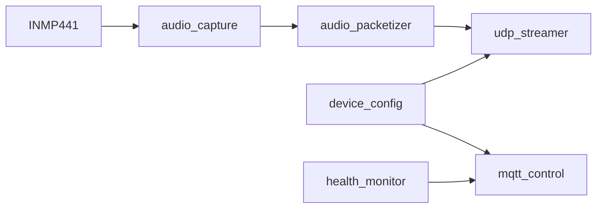

# Mic-ESP32

> `ESP32-S3` microphone node firmware for the Event-Triggered Audio Replay Agent.

## What This Node Does

The firmware turns an `ESP32-S3` into a lightweight audio uplink node:

- captures `I2S` audio from an `INMP441`
- frames `16 kHz / 16-bit / mono PCM`
- sends audio to the PC hub over UDP
- exposes telemetry and control over MQTT
- persists a small amount of runtime config in NVS

## 🔧 Firmware Pipeline



## Current MVP Features

| Area | Status |
| --- | --- |
| I2S capture | Implemented |
| UDP audio uplink | Implemented |
| MQTT commands | Implemented |
| MQTT telemetry | Implemented |
| NVS-backed config | Implemented |
| On-device long-term audio storage | Not implemented |

## Source Layout

| Path | Purpose |
| --- | --- |
| `main/main.c` | startup, Wi-Fi, task orchestration |
| `main/audio_capture.*` | I2S capture and packet queueing |
| `main/audio_packetizer.*` | packet header and PCM framing |
| `main/udp_streamer.*` | UDP socket sender |
| `main/mqtt_control.*` | MQTT command handling and telemetry |
| `main/device_config.*` | default configuration and NVS persistence |
| `main/health_monitor.*` | runtime counters and status snapshot |

## Before Build

### 1. Create the secrets file

Create:

- [`main/device_secrets.h`](main/device_secrets.h)

from:

- [`main/device_secrets.h.example`](main/device_secrets.h.example)

Fill in:

- `DEVICE_SECRET_WIFI_SSID`
- `DEVICE_SECRET_WIFI_PASS`
- `DEVICE_SECRET_MQTT_HOST`
- `DEVICE_SECRET_MQTT_PORT`
- `DEVICE_SECRET_MQTT_USER`
- `DEVICE_SECRET_MQTT_PASS`

### 2. Update device defaults

Edit [`main/device_config.c`](main/device_config.c) and set:

- `udp_host`
- `udp_port`
- `node_id`
- I2S GPIO mapping

### 3. Verify wiring

Make sure your board and microphone wiring match the configured pins.

## Device Identity

The firmware uses a two-layer identity model:

- `node_uuid`
  - derived automatically from the ESP32-S3 STA MAC
  - format: `esp32s3-<12 hex mac>`
  - used as the stable backend and MQTT key
- `node_id`
  - human-readable label
  - safe to rename independently

## Build

```sh
idf.py set-target esp32s3
idf.py build
```

## Flash

```sh
idf.py -p <SERIAL_PORT> flash monitor
```

## Audio Uplink Format

- sample rate: `16000`
- sample width: `16-bit`
- channels: `1`
- packet duration: `20 ms`
- transport: `UDP`

The packet format is defined in [`main/audio_protocol.h`](main/audio_protocol.h) and includes:

- `node_uuid`
- `node_id`
- sequence number
- timestamp
- sample metadata
- PCM payload

## 📡 MQTT Topics

### Status

- `mic/<node_uuid>/status/availability`
- `mic/<node_uuid>/status/node_id`
- `mic/<node_uuid>/status/node_uuid`
- `mic/<node_uuid>/status/streaming`
- `mic/<node_uuid>/status/rssi`
- `mic/<node_uuid>/status/uptime`
- `mic/<node_uuid>/status/packets_sent`
- `mic/<node_uuid>/status/packets_dropped`
- `mic/<node_uuid>/status/udp_target`

### Commands

- `mic/<node_uuid>/cmd/streaming/set`
- `mic/<node_uuid>/cmd/restart`
- `mic/<node_uuid>/cmd/udp_target/set`

## Notes

- audio goes over UDP, not MQTT
- the node does not store long-duration audio locally
- the PC hub is responsible for rolling buffer retention
