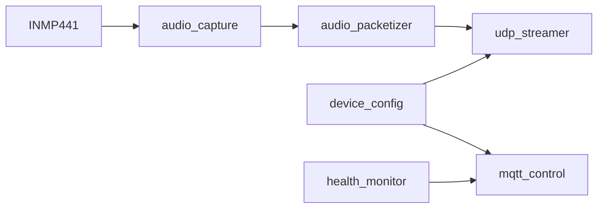

# Mic-ESP32

> `ESP32-S3` microphone node firmware for the Event-Triggered Audio Replay Agent.

## What This Node Does

The firmware turns an `ESP32-S3` into a lightweight audio uplink node:

- captures `I2S` audio from an `INMP441`
- frames `16 kHz / 16-bit / mono PCM`
- sends audio to the PC hub over UDP
- exposes telemetry and control over MQTT
- persists a small amount of runtime config in NVS
- provides a first-boot web setup portal in AP mode

## 🔧 Firmware Pipeline



## Current MVP Features

| Area | Status |
| --- | --- |
| I2S capture | Implemented |
| UDP audio uplink | Implemented |
| MQTT commands (`streaming`, `restart`, `udp_target`) | Implemented |
| MQTT telemetry and health snapshot | Implemented |
| NVS-backed config | Implemented |
| First-boot AP setup portal | Implemented |
| Local-network reconfiguration page in STA mode | Implemented |
| Video uplink for YOLO-style vision pipelines | Not implemented |

## Source Layout

| Path | Purpose |
| --- | --- |
| `main/main.c` | startup, Wi-Fi, task orchestration |
| `main/audio_capture.*` | I2S capture and packet queueing |
| `main/audio_packetizer.*` | packet header and PCM framing |
| `main/udp_streamer.*` | UDP socket sender |
| `main/mqtt_control.*` | MQTT command handling and telemetry |
| `main/device_config.*` | default configuration and NVS persistence |
| `main/health_monitor.*` | runtime counters and status snapshot |
| `main/setup_portal.*` | AP/STA configuration portal and status page |

## Setup Modes

This firmware now supports two deployment paths:

### 1. End-user path

- flash a prebuilt firmware image
- power on the device
- if the node is not configured, it starts a setup Wi-Fi AP
- open `http://192.168.4.1/`
- fill Wi-Fi, MQTT, UDP, and `node_id`
- save and reboot

After the node joins your normal Wi-Fi network, it also keeps a lightweight local settings page enabled in `STA` mode for reconfiguration.

### 2. Developer path

- optionally provide compile-time defaults through `device_secrets.h`
- build with `ESP-IDF`
- flash and test locally

If compile-time defaults are missing, the node still boots and falls back to the setup portal.

## Before Build

### 1. Create the secrets file

Create:

- [`main/device_secrets.h`](main/device_secrets.h)

from:

- [`main/device_secrets.h.example`](main/device_secrets.h.example)

Fill in:

- `DEVICE_SECRET_WIFI_SSID`
- `DEVICE_SECRET_WIFI_PASS`
- `DEVICE_SECRET_MQTT_HOST`
- `DEVICE_SECRET_MQTT_PORT`
- `DEVICE_SECRET_MQTT_USER`
- `DEVICE_SECRET_MQTT_PASS`
- `DEVICE_SECRET_UDP_HOST`
- `DEVICE_SECRET_UDP_PORT`
- `DEVICE_SECRET_NODE_ID`

This file is optional. If it is not present, the firmware uses built-in empty defaults and expects provisioning through the setup portal.

### 2. Verify device defaults

Review [`main/device_config.c`](main/device_config.c) for:

- I2S GPIO mapping
- setup button pin for forced provisioning recovery
- `streaming_enabled`
- `telemetry_interval_ms`

Network, MQTT, UDP, and `node_id` defaults come from `device_secrets.h` or are entered through the setup portal.

### 3. Verify wiring

Make sure your board and microphone wiring match the configured pins.

## Device Identity

The firmware uses a two-layer identity model:

- `node_uuid`
  - derived automatically from the ESP32-S3 STA MAC
  - format: `esp32s3-<12 hex mac>`
  - used as the stable backend and MQTT key
- `node_id`
  - human-readable label
  - safe to rename independently

## First-Boot Setup Portal

When the device does not yet have a valid runtime configuration, it starts:

- a Wi-Fi access point named `MicSetup-<last6>`
- a small HTTP setup page at `http://192.168.4.1/`

The AP password is:

```text
mic-setup
```

The setup page lets the user configure:

- Wi-Fi SSID and password
- MQTT host, port, username, and password
- UDP host and port
- `node_id`

After saving, the device writes the values to `NVS` and reboots into normal STA mode.

## Local Reconfiguration Page

When the node is already configured and connected to your router, it also serves the same configuration form on its local network IP.

That means you can:

- find the node IP from your router or DHCP leases
- open `http://<device-ip>/`
- update Wi-Fi, MQTT, UDP, or `node_id`
- save and reboot

Current limitations:

- no `mDNS` hostname is exposed yet
- no extra authentication is added beyond local network access

## Forced Recovery Setup

When a node already has saved config but you need to force it back into AP provisioning mode, hold the dedicated setup button low for 5 seconds during boot.

Board note:

- this recovery input is intentionally mapped to `GPIO9` by default in [`main/device_config.c`](main/device_config.c)
- do not reuse `GPIO0` for this path on ESP32-S3 boards, because `GPIO0` is a strapping pin and is commonly tied to the on-board BOOT button
- if your hardware uses a different non-strapping GPIO for the setup button, update `setup_button_pin` in [`main/device_config.c`](main/device_config.c)

## Build

```sh
bash -lc '
export IDF_PATH=$HOME/.espressif/v5.5.3/esp-idf
export IDF_TOOLS_PATH=$HOME/.espressif/tools
export IDF_PYTHON_ENV_PATH=$HOME/.espressif/tools/python/v5.5.3/venv
export ESP_ROM_ELF_DIR=$HOME/.espressif/tools/esp-rom-elfs/20241011
export PATH=$HOME/.espressif/tools/python/v5.5.3/venv/bin:$HOME/.espressif/tools/cmake/3.30.2/CMake.app/Contents/bin:$HOME/.espressif/tools/ninja/1.12.1:$HOME/.espressif/tools/xtensa-esp-elf/esp-14.2.0_20251107/xtensa-esp-elf/bin:$HOME/.espressif/tools/xtensa-esp-elf/esp-14.2.0_20251107/xtensa-esp-elf/xtensa-esp-elf/bin:$HOME/.espressif/tools/riscv32-esp-elf/esp-14.2.0_20251107/riscv32-esp-elf/bin:$HOME/.espressif/tools/riscv32-esp-elf/esp-14.2.0_20251107/riscv32-esp-elf/riscv32-esp-elf/bin:$PATH
cd /Users/tobiichieigetsu/Workspace/AI/Microphone/Hardware/Mic-ESP32
$HOME/.espressif/tools/python/v5.5.3/venv/bin/python $IDF_PATH/tools/idf.py build
'
```

## Flash

```sh
bash -lc '
export IDF_PATH=$HOME/.espressif/v5.5.3/esp-idf
export IDF_TOOLS_PATH=$HOME/.espressif/tools
export IDF_PYTHON_ENV_PATH=$HOME/.espressif/tools/python/v5.5.3/venv
export ESP_ROM_ELF_DIR=$HOME/.espressif/tools/esp-rom-elfs/20241011
export PATH=$HOME/.espressif/tools/python/v5.5.3/venv/bin:$HOME/.espressif/tools/cmake/3.30.2/CMake.app/Contents/bin:$HOME/.espressif/tools/ninja/1.12.1:$HOME/.espressif/tools/xtensa-esp-elf/esp-14.2.0_20251107/xtensa-esp-elf/bin:$HOME/.espressif/tools/xtensa-esp-elf/esp-14.2.0_20251107/xtensa-esp-elf/xtensa-esp-elf/bin:$HOME/.espressif/tools/riscv32-esp-elf/esp-14.2.0_20251107/riscv32-esp-elf/bin:$HOME/.espressif/tools/riscv32-esp-elf/esp-14.2.0_20251107/riscv32-esp-elf/riscv32-esp-elf/bin:$PATH
cd /Users/tobiichieigetsu/Workspace/AI/Microphone/Hardware/Mic-ESP32
$HOME/.espressif/tools/python/v5.5.3/venv/bin/python $IDF_PATH/tools/idf.py -p <SERIAL_PORT> flash monitor
'
```

## Audio Uplink Format

- sample rate: `16000`
- sample width: `16-bit`
- channels: `1`
- packet duration: `20 ms`
- transport: `UDP`

The packet format is defined in [`main/audio_protocol.h`](main/audio_protocol.h) and includes:

- `node_uuid`
- `node_id`
- sequence number
- timestamp
- sample metadata
- PCM payload

## 📡 MQTT Topics

### Status

- `mic/<node_uuid>/status/availability`
- `mic/<node_uuid>/status/node_id`
- `mic/<node_uuid>/status/node_uuid`
- `mic/<node_uuid>/status/streaming`
- `mic/<node_uuid>/status/rssi`
- `mic/<node_uuid>/status/uptime`
- `mic/<node_uuid>/status/packets_sent`
- `mic/<node_uuid>/status/packets_dropped`
- `mic/<node_uuid>/status/udp_target`

The local setup page in STA mode also shows a live status snapshot:

- current IP address
- Wi-Fi state and RSSI
- MQTT connectivity
- UDP readiness
- uptime
- packets sent / dropped

### Commands

- `mic/<node_uuid>/cmd/streaming/set`
- `mic/<node_uuid>/cmd/restart`
- `mic/<node_uuid>/cmd/udp_target/set`

## Notes

- audio goes over UDP, not MQTT
- the node is intentionally audio-uplink only and does not target local long-duration audio archival
- the PC hub is responsible for rolling buffer retention
- `node_uuid` is derived from the STA MAC at boot and is stable across reflashes
- a node with missing Wi-Fi / MQTT / UDP config automatically enters setup portal mode
