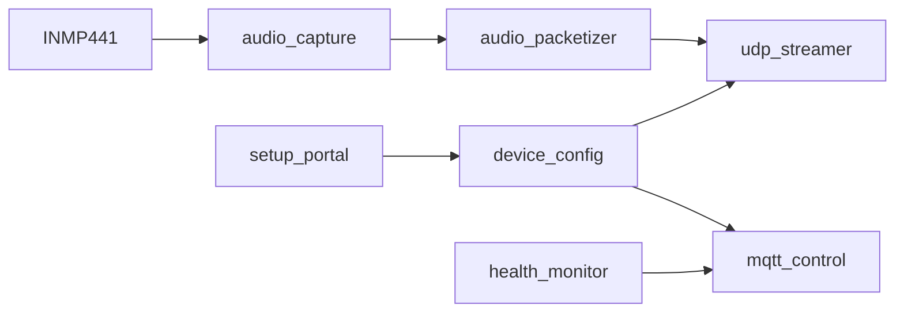

# Mic-ESP32

> 面向 Event-Triggered Audio Replay Agent 的 `ESP32-S3` 麦克风节点固件。

English version: [README.md](README.md)

## 固件流程



## 节点负责什么

- 从 `INMP441` 采集 `I2S` 音频
- 以 `16 kHz / 16-bit / mono PCM` 分帧
- 通过 UDP 把音频发送到 PC Hub
- 通过 MQTT 提供遥测和控制能力
- 把运行配置保存到 NVS
- 在 AP 模式下提供网页配网，并在 STA 模式下保留局域网重配置页面

## 配网生命周期

### 首次启动

如果设备没有有效运行配置，它会启动：

- Wi-Fi AP `MicSetup-<last6>`
- HTTP 配置页 `http://192.168.4.1/`

用户需要填写：

- Wi-Fi SSID 和密码
- MQTT host、port、username、password
- UDP host 和 port
- `node_id`

保存后，设备会把配置写入 NVS，然后重启进入正常 STA 模式。

### 正常运行

当节点连入路由器后，同一个配置表单会继续挂在设备的局域网 IP 上，便于后续修改。

### 强制恢复

如果要强制重新进入 AP 配网：

- 开机时将独立 setup 按键持续拉低 5 秒
- 默认恢复引脚是 `CONFIG_MIC_SETUP_BUTTON_GPIO` 对应的 `GPIO9`
- 不要在 ESP32-S3 上把这条路径接到 `GPIO0`

## 身份模型

- `node_uuid`
  从 ESP32-S3 的 STA MAC 派生，是稳定的后端与 MQTT 主键
- `node_id`
  人类可读名称，可以独立改名

## 构建输入

### 可选的编译期 secrets

如果你想嵌入默认值，可以从 `main/device_secrets.h.example` 生成 `main/device_secrets.h`，内容包括：

- Wi-Fi
- MQTT
- UDP 目标
- `node_id`

如果没有这个文件，固件仍会启动，并自动回退到 setup portal。

### 可配置默认值

请检查 `sdkconfig.defaults` 和 `Kconfig.projbuild` 中这些项：

- I2S GPIO 映射
- setup 按键引脚
- 默认 streaming 状态
- telemetry 间隔
- setup 重试时序
- 音频包队列深度

如果你是从仓库根 README 跳转过来，请以本页为准执行受支持的 ESP-IDF 命令和环境配置。

在 ESP-IDF `v5.5.3` 中，旧的 CPU 频率符号 `CONFIG_ESP32S3_DEFAULT_CPU_FREQ_240` 已经迁移为 `CONFIG_ESP_DEFAULT_CPU_FREQ_MHZ_240`。

## 构建

```sh
bash -lc '
export IDF_PATH=$HOME/.espressif/v5.5.3/esp-idf
export IDF_TOOLS_PATH=$HOME/.espressif/tools
export IDF_PYTHON_ENV_PATH=$HOME/.espressif/tools/python/v5.5.3/venv
export ESP_ROM_ELF_DIR=$HOME/.espressif/tools/esp-rom-elfs/20241011
export PATH=$HOME/.espressif/tools/python/v5.5.3/venv/bin:$HOME/.espressif/tools/cmake/3.30.2/CMake.app/Contents/bin:$HOME/.espressif/tools/ninja/1.12.1:$HOME/.espressif/tools/xtensa-esp-elf/esp-14.2.0_20251107/xtensa-esp-elf/bin:$HOME/.espressif/tools/xtensa-esp-elf/esp-14.2.0_20251107/xtensa-esp-elf/xtensa-esp-elf/bin:$HOME/.espressif/tools/riscv32-esp-elf/esp-14.2.0_20251107/riscv32-esp-elf/bin:$HOME/.espressif/tools/riscv32-esp-elf/esp-14.2.0_20251107/riscv32-esp-elf/riscv32-esp-elf/bin:$PATH
cd /Users/tobiichieigetsu/Workspace/AI/Microphone/Hardware/Mic-ESP32
$HOME/.espressif/tools/python/v5.5.3/venv/bin/python $IDF_PATH/tools/idf.py build
'
```

## 烧录

```sh
bash -lc '
export IDF_PATH=$HOME/.espressif/v5.5.3/esp-idf
export IDF_TOOLS_PATH=$HOME/.espressif/tools
export IDF_PYTHON_ENV_PATH=$HOME/.espressif/tools/python/v5.5.3/venv
export ESP_ROM_ELF_DIR=$HOME/.espressif/tools/esp-rom-elfs/20241011
export PATH=$HOME/.espressif/tools/python/v5.5.3/venv/bin:$HOME/.espressif/tools/cmake/3.30.2/CMake.app/Contents/bin:$HOME/.espressif/tools/ninja/1.12.1:$HOME/.espressif/tools/xtensa-esp-elf/esp-14.2.0_20251107/xtensa-esp-elf/bin:$HOME/.espressif/tools/xtensa-esp-elf/esp-14.2.0_20251107/xtensa-esp-elf/xtensa-esp-elf/bin:$HOME/.espressif/tools/riscv32-esp-elf/esp-14.2.0_20251107/riscv32-esp-elf/bin:$HOME/.espressif/tools/riscv32-esp-elf/esp-14.2.0_20251107/riscv32-esp-elf/riscv32-esp-elf/bin:$PATH
cd /Users/tobiichieigetsu/Workspace/AI/Microphone/Hardware/Mic-ESP32
$HOME/.espressif/tools/python/v5.5.3/venv/bin/python $IDF_PATH/tools/idf.py -p <SERIAL_PORT> flash monitor
'
```

## 继续阅读

- [../../docs/protocols.zh-CN.md](../../docs/protocols.zh-CN.md)
  音频上行格式、MQTT topics 和对外协议细节。
- [../../docs/verification.zh-CN.md](../../docs/verification.zh-CN.md)
  验证流程和模拟上行说明。

## 备注

- 音频走 UDP，不走 MQTT。
- 节点设计上就是纯音频上行。
- 滚动缓存保留由 PC Hub 负责。
