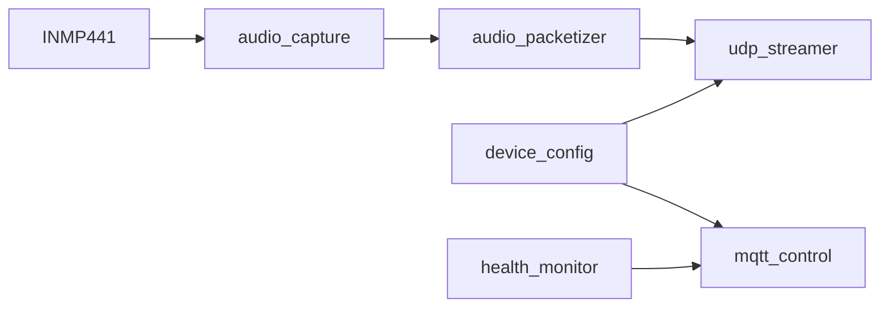

# Mic-ESP32

> 面向 Event-Triggered Audio Replay Agent 的 `ESP32-S3` 麦克风节点固件。

English version: [README.md](README.md)

## 这个节点做什么

这份固件会把 `ESP32-S3` 变成一个轻量音频上行节点：

- 从 `INMP441` 采集 `I2S` 音频
- 将音频按 `16 kHz / 16-bit / mono PCM` 分帧
- 通过 UDP 把音频发到 PC hub
- 通过 MQTT 暴露遥测和控制能力
- 使用 `NVS` 保存少量运行配置
- 在 `AP` 模式下提供首次网页初始化门户

## 🔧 固件流程



## 当前 MVP 功能

| 区域 | 状态 |
| --- | --- |
| I2S 采集 | 已实现 |
| UDP 音频上行 | 已实现 |
| MQTT 命令 | 已实现 |
| MQTT 遥测 | 已实现 |
| NVS 配置持久化 | 已实现 |
| 首次网页初始化门户 | 已实现 |
| 设备端长期音频存储 | 未实现 |

## 代码结构

| 路径 | 用途 |
| --- | --- |
| `main/main.c` | 启动、Wi‑Fi、任务编排 |
| `main/audio_capture.*` | I2S 采集与队列投递 |
| `main/audio_packetizer.*` | 包头与 PCM 分帧 |
| `main/udp_streamer.*` | UDP socket 发送 |
| `main/mqtt_control.*` | MQTT 命令处理与遥测 |
| `main/device_config.*` | 默认配置与 NVS 持久化 |
| `main/health_monitor.*` | 运行计数器与状态快照 |

## 配置模式

这份固件现在支持两种部署路径。

### 1. 普通用户路径

- 烧录预编译固件
- 设备上电
- 如果节点尚未配置，会自动启动 setup Wi‑Fi AP
- 打开 `http://192.168.4.1/`
- 填写 Wi‑Fi、MQTT、UDP 和 `node_id`
- 保存并重启

节点加入正常 Wi‑Fi 后，还会在 `STA` 模式下继续暴露一个轻量配置页，方便后续重配置。

### 2. 开发者路径

- 可选通过 `device_secrets.h` 提供编译期默认值
- 使用 `ESP-IDF` 构建
- 本地烧录和调试

如果没有编译期 secrets，固件仍然可以启动，并自动回退到 setup portal。

## 构建前准备

### 1. 创建 secrets 文件

创建：

- [`main/device_secrets.h`](main/device_secrets.h)

参考：

- [`main/device_secrets.h.example`](main/device_secrets.h.example)

需要填写：

- `DEVICE_SECRET_WIFI_SSID`
- `DEVICE_SECRET_WIFI_PASS`
- `DEVICE_SECRET_MQTT_HOST`
- `DEVICE_SECRET_MQTT_PORT`
- `DEVICE_SECRET_MQTT_USER`
- `DEVICE_SECRET_MQTT_PASS`
- `DEVICE_SECRET_UDP_HOST`
- `DEVICE_SECRET_UDP_PORT`
- `DEVICE_SECRET_NODE_ID`

这个文件是可选的。如果不存在，固件会使用内置空默认值，并期待通过 setup portal 完成初始化。

### 2. 更新设备默认值

编辑 [`main/device_config.c`](main/device_config.c)，设置：

- `udp_host`
- `udp_port`
- `node_id`
- I2S GPIO 引脚映射

### 3. 检查接线

确认开发板和麦克风接线与配置中的引脚一致。

## 设备身份模型

固件采用两层身份设计：

- `node_uuid`
  - 自动从 ESP32-S3 的 STA MAC 派生
  - 格式为 `esp32s3-<12 hex mac>`
  - 用作稳定的后端 / MQTT 主键
- `node_id`
  - 人类可读名称
  - 可以单独改名

## 首次初始化门户

当设备还没有有效运行配置时，它会启动：

- 名为 `MicSetup-<last6>` 的 Wi‑Fi 热点
- 一个位于 `http://192.168.4.1/` 的轻量配置页

热点密码是：

```text
mic-setup
```

配置页允许用户填写：

- Wi‑Fi SSID 和密码
- MQTT host、port、username、password
- UDP host 和 port
- `node_id`

保存后，设备会把这些值写入 `NVS`，然后重启进入正常 `STA` 模式。

## 局域网重配置页面

当节点已经配置完成并连接到路由器后，它会在本地局域网 IP 上继续提供相同的配置表单。

也就是说你可以：

- 在路由器或 DHCP 租约里找到节点 IP
- 打开 `http://<device-ip>/`
- 修改 Wi‑Fi、MQTT、UDP 或 `node_id`
- 保存并重启

当前限制：

- 暂时没有 `mDNS` 主机名
- 暂时没有额外认证，只依赖局域网访问边界

## 构建

```sh
idf.py set-target esp32s3
idf.py build
```

## 烧录

```sh
idf.py -p <SERIAL_PORT> flash monitor
```

## 音频上行格式

- 采样率：`16000`
- 采样宽度：`16-bit`
- 声道：`1`
- 包时长：`20 ms`
- 传输方式：`UDP`

数据包格式定义在 [`main/audio_protocol.h`](main/audio_protocol.h)，包含：

- `node_uuid`
- `node_id`
- 序列号
- 时间戳
- 采样元信息
- PCM payload

## 📡 MQTT Topics

### 状态上报

- `mic/<node_uuid>/status/availability`
- `mic/<node_uuid>/status/node_id`
- `mic/<node_uuid>/status/node_uuid`
- `mic/<node_uuid>/status/streaming`
- `mic/<node_uuid>/status/rssi`
- `mic/<node_uuid>/status/uptime`
- `mic/<node_uuid>/status/packets_sent`
- `mic/<node_uuid>/status/packets_dropped`
- `mic/<node_uuid>/status/udp_target`

### 控制命令

- `mic/<node_uuid>/cmd/streaming/set`
- `mic/<node_uuid>/cmd/restart`
- `mic/<node_uuid>/cmd/udp_target/set`

## 备注

- 音频走 UDP，不走 MQTT
- 节点本地不保存长时间音频
- PC hub 负责滚动缓存保留
- 缺少 Wi‑Fi / MQTT / UDP 配置的节点会自动进入 setup portal 模式
