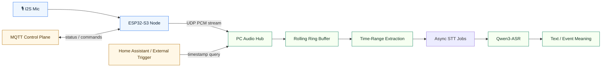
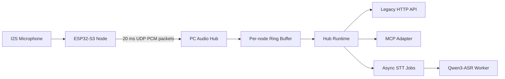

# Event-Triggered Audio Replay Agent

> A local-first audio sensing stack built around `ESP32-S3`, UDP audio uplink, short-horizon replay, and on-device-triggered ASR on the PC side.

中文说明见：[README.zh-CN.md](README.zh-CN.md)


## 🗺️ Architecture Overview



## Overview

This repository is split into two deployable pieces:

- [`Hardware/Mic-ESP32`](Hardware/Mic-ESP32): the `ESP32-S3` microphone node firmware
- [`Software/pc_hub`](Software/pc_hub): the PC-side UDP hub, ring buffer, and local ASR worker

Today, the system does this:

- captures microphone audio from an `ESP32-S3`
- streams `16 kHz / 16-bit / mono PCM` over UDP
- buffers recent audio on the PC
- extracts windows by time range
- runs local ASR with `Qwen3-ASR-0.6B`
- supports first-boot web provisioning on the device side

## At A Glance

| Layer | Role | Current implementation |
| --- | --- | --- |
| Edge node | Capture audio and uplink packets | `ESP32-S3 + INMP441` |
| Transport | Real-time audio data plane | `UDP` |
| Control plane | Telemetry and commands | `MQTT` |
| Hub | Receive, buffer, and serve audio windows | `Software/pc_hub` |
| ASR | Local speech transcription | `Qwen3-ASR-0.6B` |

## 🔊 System Flow



## Repository Layout

```text
Hardware/
  Mic-ESP32/                ESP-IDF firmware
Software/
  pc_hub/                   UDP ingest + HTTP query + local ASR
event_triggered_audio_replay_agent.md
AGENTS.md
```

## 🚀 Deployment Path

### 1. Hardware Node

Deploy the firmware in [`Hardware/Mic-ESP32`](Hardware/Mic-ESP32):

- flash a prebuilt firmware or build with `ESP-IDF`
- on first boot, connect to the node setup AP if it is not yet configured
- open `http://192.168.4.1/`
- fill Wi-Fi, MQTT, UDP, and `node_id`
- reboot into normal streaming mode

See the hardware-specific guide:

- [`Hardware/Mic-ESP32/README.md`](Hardware/Mic-ESP32/README.md)

### 2. PC Hub

Deploy the hub in [`Software/pc_hub`](Software/pc_hub):

- install the Python package
- start the `Qwen3-ASR` worker
- start the UDP hub
- query recent audio or transcription through MCP

See the hub-specific guide:

- [`Software/pc_hub/README.md`](Software/pc_hub/README.md)

## Quick Start

### Build and flash the ESP32-S3

```sh
cd Hardware/Mic-ESP32
idf.py set-target esp32s3
idf.py build
idf.py -p <SERIAL_PORT> flash monitor
```

### First-boot device setup

If the node has no valid runtime configuration, it starts a setup portal:

- connect to `MicSetup-<last6>`
- use password `mic-setup`
- open [http://192.168.4.1](http://192.168.4.1)
- save Wi-Fi, MQTT, UDP, and `node_id`

### Reconfigure a deployed device

Once the node is already connected to your router in `STA` mode, it also exposes the same lightweight configuration page on its local IP:

- find the device IP in your router or DHCP leases
- open `http://<device-ip>/`
- update settings and reboot

### Install the PC hub

```sh
cd Software/pc_hub
python3 -m pip install -e .
```

### Start the ASR worker

```sh
cd Software/pc_hub
export PC_HUB_ASR_MODEL=Qwen/Qwen3-ASR-0.6B
export PC_HUB_ASR_LANGUAGE=zh
export PC_HUB_ASR_DEVICE_MAP=mps
export PC_HUB_ASR_DTYPE=float16
python3 -m worker.main
```

### Start the hub

```sh
cd Software/pc_hub
export PC_HUB_BIND_HOST=127.0.0.1
export PC_HUB_HTTP_PORT=8765
export PC_HUB_UDP_HOST=0.0.0.0
export PC_HUB_UDP_PORT=4000
export PC_HUB_RING_MINUTES=10
export PC_HUB_WORKER_URL=http://127.0.0.1:8766/transcribe
python3 -m hub.main
```

## ✅ Verification

### Worker smoke test

```sh
curl -X POST http://127.0.0.1:8766/transcribe \
  -H 'Content-Type: application/json' \
  -d '{
    "job_id":"manual-test",
    "audio_path":"./path/to/audio.wav",
    "node_uuid":"manual-node",
    "node_id":"manual-node",
    "start_time":0,
    "end_time":1
  }'
```

### Hub liveness check

```sh
curl http://127.0.0.1:8765/nodes
```

### End-to-end query

```sh
curl -X POST http://127.0.0.1:8765/query/stt \
  -H 'Content-Type: application/json' \
  -d '{
    "node_uuid":"esp32s3-xxxxxxxxxxxx",
    "start_time":1710000000.1,
    "end_time":1710000030.1
  }'
```

Then poll the returned job:

```sh
curl http://127.0.0.1:8765/jobs/<job_id>
```

## 🧪 Simulated Uplink Status

This repository has already been validated with a simulated `ESP32` uplink:

- source audio converted to WAV
- split into `20 ms` PCM packets
- uploaded over UDP using the current firmware packet format
- hub registered the simulated node
- legacy `/query/audio` succeeded
- legacy async `/query/stt` job flow succeeded

That proved the chain:

```text
audio file -> simulated UDP packets -> pc_hub -> ring buffer -> WAV extraction -> Qwen3-ASR -> text
```

## Notes & Limits

- query timebase is `PC receive time`, not the embedded timestamp
- the AI-facing entrypoint is now MCP; the legacy HTTP query API remains for compatibility
- the worker currently returns a single transcription string, not aligned word timings
- `Qwen3-ASR-0.6B` is better than the previous Whisper-based local setup for Chinese tests, but still not perfect
- the project is audio-first right now; video ingestion and YOLO-style vision analysis are future work

## Related Files

- [`event_triggered_audio_replay_agent.md`](event_triggered_audio_replay_agent.md)
- [`Hardware/Mic-ESP32/README.md`](Hardware/Mic-ESP32/README.md)
- [`Software/pc_hub/README.md`](Software/pc_hub/README.md)
- [`AGENTS.md`](AGENTS.md)

---

<p align="center">⭐ Built for local-first, event-triggered audio replay.</p>
