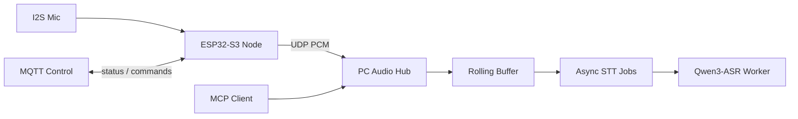

# Event-Triggered Audio Replay Agent

> A local-first sensing stack built around `ESP32-S3`, UDP audio uplink, short-horizon replay, and PC-side ASR.

中文说明见：[README.zh-CN.md](README.zh-CN.md)


## Architecture



## What This Repo Contains

- [Hardware/Mic-ESP32](Hardware/Mic-ESP32)
  ESP-IDF firmware for the microphone node.
- [Software/pc_hub](Software/pc_hub)
  PC-side UDP ingest, rolling buffer, MCP server, and local ASR worker.

Today the system does this:

- captures `16 kHz / 16-bit / mono PCM` on `ESP32-S3`
- streams audio to the PC over UDP
- tracks nodes by `node_uuid`
- buffers recent audio on the PC
- submits async STT jobs to `Qwen3-ASR`
- exposes MCP as the preferred AI-facing interface

## Fastest Path

### Hardware

Use the supported ESP-IDF 5.5.3 commands in:

- [Hardware/Mic-ESP32/README.md](Hardware/Mic-ESP32/README.md)

If the node has no runtime config, it boots into setup mode:

- connect to `MicSetup-<last6>`
- open `http://192.168.4.1/`
- fill Wi-Fi, MQTT, UDP, and `node_id`

### Software

The recommended runtime path is:

1. install the Python package
2. start `worker.main`
3. start `mcp_adapter.main`
4. use MCP as the primary interface

Minimal example:

```sh
cd Software/pc_hub
python3 -m pip install -e .

export PC_HUB_ASR_MODEL=Qwen/Qwen3-ASR-0.6B
export PC_HUB_ASR_LANGUAGE=zh
export PC_HUB_ASR_DEVICE_MAP=mps
export PC_HUB_ASR_DTYPE=float16
python3 -m worker.main
```

```sh
cd Software/pc_hub
export PC_HUB_MCP_BIND_HOST=127.0.0.1
export PC_HUB_MCP_PORT=8767
export PC_HUB_MCP_PATH=/mcp
python3 -m mcp_adapter.main
```

MCP endpoint:

```text
http://127.0.0.1:8767/mcp
```

Legacy HTTP remains available for compatibility and debugging, but it is optional and disabled by default.

## Where To Read Next

- [Hardware/Mic-ESP32/README.md](Hardware/Mic-ESP32/README.md)
  Firmware setup, provisioning flow, build, flash, and node behavior.
- [Software/pc_hub/README.md](Software/pc_hub/README.md)
  Runtime model, configuration, recommended startup path, Docker, and legacy API.
- [docs/verification.md](docs/verification.md)
  Worker smoke checks, MCP validation notes, simulated uplink status, and legacy HTTP verification.
- [docs/protocols.md](docs/protocols.md)
  Audio uplink format, MQTT topics, timebase, and public integration contracts.

## Notes

- `node_uuid` is derived from the ESP32-S3 STA MAC and is the stable backend key.
- `node_id` is the human-readable label configured locally.
- Query windows use `pc_receive_time`, not the embedded packet timestamp.
- The project is audio-first right now; video ingestion is future work.

## Star History

<a href="https://www.star-history.com/?repos=Tobi1chi%2FEchoTrigger&type=date&legend=top-left">
 <picture>
   <source media="(prefers-color-scheme: dark)" srcset="https://api.star-history.com/image?repos=Tobi1chi/EchoTrigger&type=date&theme=dark&legend=top-left" />
   <source media="(prefers-color-scheme: light)" srcset="https://api.star-history.com/image?repos=Tobi1chi/EchoTrigger&type=date&legend=top-left" />
   
 </picture>
</a>
