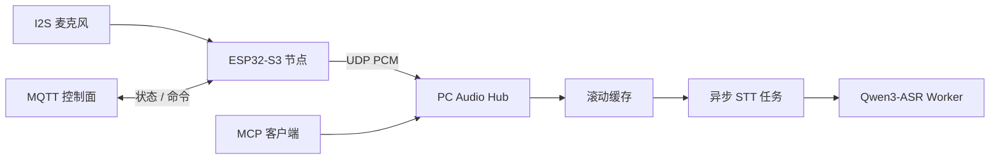

# 事件触发音频回放代理

> 一个基于 `ESP32-S3`、UDP 音频上行、短时回放和 PC 侧 ASR 的本地优先感知系统。

English version: [README.md](README.md)


## 架构



## 仓库包含什么

- [Hardware/Mic-ESP32](Hardware/Mic-ESP32)
  麦克风节点的 ESP-IDF 固件。
- [Software/pc_hub](Software/pc_hub)
  PC 侧 UDP 接收、滚动缓冲、MCP 服务和本地 ASR worker。

当前系统能力：

- 在 `ESP32-S3` 上采集 `16 kHz / 16-bit / mono PCM`
- 通过 UDP 把音频发到 PC
- 通过 `node_uuid` 跟踪节点
- 在 PC 上缓存最近一段时间的音频
- 把 STT 任务异步提交给 `Qwen3-ASR`
- 默认通过 MCP 提供 AI 访问入口

## 最快跑通路径

### 硬件

请直接使用这里维护的 ESP-IDF 5.5.3 受支持命令：

- [Hardware/Mic-ESP32/README.zh-CN.md](Hardware/Mic-ESP32/README.zh-CN.md)

如果节点还没有运行配置，它会进入 setup 模式：

- 连接 `MicSetup-<last6>`
- 打开 `http://192.168.4.1/`
- 填写 Wi-Fi、MQTT、UDP 和 `node_id`

### 软件

推荐的软件启动路径是：

1. 安装 Python 包
2. 启动 `worker.main`
3. 启动 `mcp_adapter.main`
4. 通过 MCP 使用系统

最小示例：

```sh
cd Software/pc_hub
python3 -m pip install -e .

export PC_HUB_ASR_MODEL=Qwen/Qwen3-ASR-0.6B
export PC_HUB_ASR_LANGUAGE=zh
export PC_HUB_ASR_DEVICE_MAP=mps
export PC_HUB_ASR_DTYPE=float16
python3 -m worker.main
```

```sh
cd Software/pc_hub
export PC_HUB_MCP_BIND_HOST=127.0.0.1
export PC_HUB_MCP_PORT=8767
export PC_HUB_MCP_PATH=/mcp
python3 -m mcp_adapter.main
```

MCP 端点：

```text
http://127.0.0.1:8767/mcp
```

legacy HTTP 仍然可用于兼容和手动调试，但它不是默认路径，而且默认关闭。

## 继续阅读

- [Hardware/Mic-ESP32/README.zh-CN.md](Hardware/Mic-ESP32/README.zh-CN.md)
  固件配网流程、构建、烧录和节点行为。
- [Software/pc_hub/README.zh-CN.md](Software/pc_hub/README.zh-CN.md)
  运行模型、配置项、推荐启动方式、Docker 和 legacy API。
- [docs/verification.zh-CN.md](docs/verification.zh-CN.md)
  worker 冒烟测试、MCP 验证说明、模拟上行验证和 legacy HTTP 验证。
- [docs/protocols.zh-CN.md](docs/protocols.zh-CN.md)
  音频上行格式、MQTT topics、时间基准和对外接口约定。

## 备注

- `node_uuid` 由 ESP32-S3 的 STA MAC 派生，是稳定的后端主键。
- `node_id` 是本地可改的人类可读名称。
- 查询使用 `pc_receive_time`，不是设备包头里的时间戳。
- 当前项目以音频为主，视频接入仍是后续工作。

## Star History

<a href="https://www.star-history.com/?repos=Tobi1chi%2FEchoTrigger&type=date&legend=top-left">
 <picture>
   <source media="(prefers-color-scheme: dark)" srcset="https://api.star-history.com/image?repos=Tobi1chi/EchoTrigger&type=date&theme=dark&legend=top-left" />
   <source media="(prefers-color-scheme: light)" srcset="https://api.star-history.com/image?repos=Tobi1chi/EchoTrigger&type=date&legend=top-left" />
   
 </picture>
</a>
