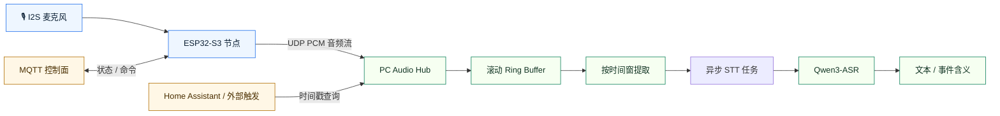
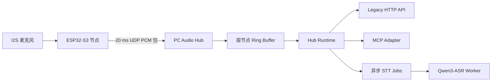

# 事件触发音频回放代理

> 基于 `ESP32-S3` 的本地优先音频感知系统 —— 持续采集、UDP 上行、短时回放，在 PC 侧按需触发语音识别。

English version: [README.md](README.md)


## 🗺️ 架构总览



## 项目概览

项目分为两个独立部署的部分：

- [`Hardware/Mic-ESP32`](Hardware/Mic-ESP32)：`ESP32-S3` 麦克风节点固件
- [`Software/pc_hub`](Software/pc_hub)：PC 侧 UDP Hub、Ring Buffer 和本地 ASR Worker

目前已经实现的能力：

- 通过 `ESP32-S3` 持续采集麦克风音频
- 以 `16 kHz / 16-bit / mono PCM` 格式通过 UDP 实时上传
- 在 PC 上滚动缓存最近一段时间的音频
- 支持按时间范围提取音频片段
- 使用 `Qwen3-ASR-0.6B` 在本地完成语音识别
- 首次上电时通过网页完成设备配置

## 一览

| 层级 | 作用 | 当前实现 |
| --- | --- | --- |
| 边缘节点 | 采集音频并上行 | `ESP32-S3 + INMP441` |
| 传输层 | 实时音频数据面 | `UDP` |
| 控制面 | 遥测与命令 | `MQTT` |
| Hub | 接收、缓存、查询音频窗口 | `Software/pc_hub` |
| ASR | 本地语音转写 | `Qwen3-ASR-0.6B` |

## 🔊 系统数据流



## 仓库结构

```text
Hardware/
  Mic-ESP32/                ESP-IDF 固件
Software/
  pc_hub/                   UDP 接收 + HTTP 查询 + 本地 ASR
event_triggered_audio_replay_agent.md
AGENTS.md
```

## 🚀 部署路径

### 1. 硬件节点

把 [`Hardware/Mic-ESP32`](Hardware/Mic-ESP32) 的固件烧到板子上：

- 直接烧录预编译固件，或用 `ESP-IDF` 自己编译
- 第一次开机如果还没配置过，设备会自动开启一个 setup AP
- 浏览器打开 `http://192.168.4.1/`
- 填好 Wi‑Fi、MQTT、UDP 和 `node_id`
- 保存后重启，进入正常工作模式

详细说明见：

- [`Hardware/Mic-ESP32/README.md`](Hardware/Mic-ESP32/README.md)

### 2. PC Hub

部署 [`Software/pc_hub`](Software/pc_hub)：

- 安装 Python 包
- 启动 `Qwen3-ASR` worker
- 启动 UDP hub
- 通过 MCP 查询音频和转写任务

详细说明见：

- [`Software/pc_hub/README.md`](Software/pc_hub/README.md)

## 快速开始

### 构建并烧录 ESP32-S3

```sh
cd Hardware/Mic-ESP32
idf.py set-target esp32s3
idf.py build
idf.py -p <SERIAL_PORT> flash monitor
```

### 首次设备配置

节点还没配过的话，上电后会自动进入配置模式：

- 手机或电脑连上 Wi-Fi `MicSetup-<last6>`
- 密码是 `mic-setup`
- 浏览器打开 [http://192.168.4.1](http://192.168.4.1)
- 填好 Wi‑Fi、MQTT、UDP 和 `node_id` 后保存

### 修改已部署设备的配置

节点连上你的路由器之后，也可以直接通过局域网 IP 访问同一个配置页面：

- 在路由器管理页或 DHCP 列表里找到设备 IP
- 浏览器打开 `http://<device-ip>/`
- 改完配置后保存重启即可

### 安装 PC Hub

```sh
cd Software/pc_hub
python3 -m pip install -e .
```

### 启动 ASR Worker

```sh
cd Software/pc_hub
export PC_HUB_ASR_MODEL=Qwen/Qwen3-ASR-0.6B
export PC_HUB_ASR_LANGUAGE=zh
export PC_HUB_ASR_DEVICE_MAP=mps
export PC_HUB_ASR_DTYPE=float16
python3 -m worker.main
```

### 启动 Hub

```sh
cd Software/pc_hub
export PC_HUB_BIND_HOST=127.0.0.1
export PC_HUB_HTTP_PORT=8765
export PC_HUB_UDP_HOST=0.0.0.0
export PC_HUB_UDP_PORT=4000
export PC_HUB_RING_MINUTES=10
export PC_HUB_WORKER_URL=http://127.0.0.1:8766/transcribe
python3 -m hub.main
```

## ✅ 验证

### Worker 冒烟测试

```sh
curl -X POST http://127.0.0.1:8766/transcribe \
  -H 'Content-Type: application/json' \
  -d '{
    "job_id":"manual-test",
    "audio_path":"./path/to/audio.wav",
    "node_uuid":"manual-node",
    "node_id":"manual-node",
    "start_time":0,
    "end_time":1
  }'
```

### Hub 存活检查

```sh
curl http://127.0.0.1:8765/nodes
```

### 端到端查询

```sh
curl -X POST http://127.0.0.1:8765/query/stt \
  -H 'Content-Type: application/json' \
  -d '{
    "node_uuid":"esp32s3-xxxxxxxxxxxx",
    "start_time":1710000000.1,
    "end_time":1710000030.1
  }'
```

然后轮询返回的任务：

```sh
curl http://127.0.0.1:8765/jobs/<job_id>
```

## 🧪 模拟上行验证

整条链路已经通过模拟 `ESP32` 上行跑通过：

- 源音频转成 WAV 后切成 `20 ms` PCM 包
- 按固件协议格式通过 UDP 发送
- hub 正确注册了模拟节点
- legacy `/query/audio` 和异步 `/query/stt` 均正常工作

验证过的完整链路：

```text
音频文件 -> 模拟 UDP 包 -> pc_hub -> ring buffer -> WAV 提取 -> Qwen3-ASR -> 文本
```

## 注意事项与已知限制

- 查询使用的时间轴是 `PC receive time`（PC 收到数据包的时间），而不是固件包头里的设备时间戳
- 面向 AI 的主入口现在是 MCP；legacy HTTP 查询 API 仅保留作兼容用途
- Worker 目前只返回整段转写文本，还不支持逐词时间对齐
- `Qwen3-ASR-0.6B` 中文效果比之前的 Whisper 方案好不少，但离完美还有距离
- 目前只做了音频，视频接入和 YOLO 之类的视觉分析是后面的事

## 相关文件

- [`event_triggered_audio_replay_agent.zh-CN.md`](event_triggered_audio_replay_agent.zh-CN.md)
- [`Hardware/Mic-ESP32/README.zh-CN.md`](Hardware/Mic-ESP32/README.zh-CN.md)
- [`Software/pc_hub/README.zh-CN.md`](Software/pc_hub/README.zh-CN.md)
- [`AGENTS.zh-CN.md`](AGENTS.zh-CN.md)

## Star History

<a href="https://www.star-history.com/?repos=Tobi1chi%2FEchoTrigger&type=date&legend=top-left">
 <picture>
   <source media="(prefers-color-scheme: dark)" srcset="https://api.star-history.com/image?repos=Tobi1chi/EchoTrigger&type=date&theme=dark&legend=top-left" />
   <source media="(prefers-color-scheme: light)" srcset="https://api.star-history.com/image?repos=Tobi1chi/EchoTrigger&type=date&legend=top-left" />
   
 </picture>
</a>
