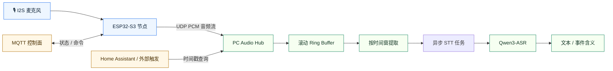
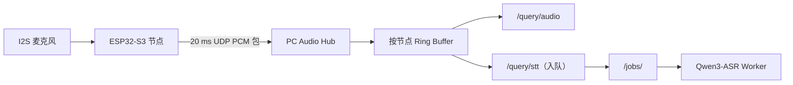

# 事件触发音频回放代理

> 一个本地优先的音频感知系统，围绕 `ESP32-S3`、UDP 音频上行、短时回放，以及 PC 侧事件触发 ASR 构建。

English version: [README.md](README.md)


## 🗺️ 架构总览



## Overview

这个仓库目前由两部分可部署系统组成：

- [`Hardware/Mic-ESP32`](Hardware/Mic-ESP32)：`ESP32-S3` 麦克风节点固件
- [`Software/pc_hub`](Software/pc_hub)：PC 侧 UDP hub、ring buffer 和本地 ASR worker

当前系统能力：

- 从 `ESP32-S3` 采集麦克风音频
- 通过 UDP 持续上传 `16 kHz / 16-bit / mono PCM`
- 在 PC 上缓存最近一段时间音频
- 按时间范围提取音频窗口
- 使用 `Qwen3-ASR-0.6B` 做本地语音识别
- 设备端支持首次网页初始化配置

## 一览

| 层级 | 作用 | 当前实现 |
| --- | --- | --- |
| 边缘节点 | 采集音频并上行 | `ESP32-S3 + INMP441` |
| 传输层 | 实时音频数据面 | `UDP` |
| 控制面 | 遥测与命令 | `MQTT` |
| Hub | 接收、缓存、查询音频窗口 | `Software/pc_hub` |
| ASR | 本地语音转写 | `Qwen3-ASR-0.6B` |

## 🔊 系统数据流



## 仓库结构

```text
Hardware/
  Mic-ESP32/                ESP-IDF 固件
Software/
  pc_hub/                   UDP 接收 + HTTP 查询 + 本地 ASR
event_triggered_audio_replay_agent.md
AGENTS.md
```

## 🚀 部署路径

### 1. 硬件节点

部署 [`Hardware/Mic-ESP32`](Hardware/Mic-ESP32) 中的固件：

- 烧录预编译固件，或使用 `ESP-IDF` 自行构建
- 首次启动如果还未配置，连接设备的 setup AP
- 打开 `http://192.168.4.1/`
- 填写 Wi‑Fi、MQTT、UDP 和 `node_id`
- 重启进入正常工作模式

详细说明见：

- [`Hardware/Mic-ESP32/README.md`](Hardware/Mic-ESP32/README.md)

### 2. PC Hub

部署 [`Software/pc_hub`](Software/pc_hub)：

- 安装 Python 包
- 启动 `Qwen3-ASR` worker
- 启动 UDP hub
- 通过 HTTP 查询音频和转写任务

详细说明见：

- [`Software/pc_hub/README.md`](Software/pc_hub/README.md)

## Quick Start

### 构建并烧录 ESP32-S3

```sh
cd Hardware/Mic-ESP32
idf.py set-target esp32s3
idf.py build
idf.py -p <SERIAL_PORT> flash monitor
```

### 首次设备初始化

如果节点没有有效运行配置，它会启动配置门户：

- 连接 `MicSetup-<last6>`
- 密码使用 `mic-setup`
- 打开 [http://192.168.4.1](http://192.168.4.1)
- 保存 Wi‑Fi、MQTT、UDP 和 `node_id`

### 重配置已部署设备

当节点已经通过 `STA` 模式连接到路由器后，它也会在局域网 IP 上暴露同一个轻量配置页面：

- 从路由器或 DHCP 租约里找到设备 IP
- 打开 `http://<device-ip>/`
- 修改配置并重启

### 安装 PC Hub

```sh
cd Software/pc_hub
python3 -m pip install -e .
```

### 启动 ASR worker

```sh
cd Software/pc_hub
export PC_HUB_ASR_MODEL=Qwen/Qwen3-ASR-0.6B
export PC_HUB_ASR_LANGUAGE=zh
export PC_HUB_ASR_DEVICE_MAP=mps
export PC_HUB_ASR_DTYPE=float16
python3 -m worker.main
```

### 启动 Hub

```sh
cd Software/pc_hub
export PC_HUB_BIND_HOST=127.0.0.1
export PC_HUB_HTTP_PORT=8765
export PC_HUB_UDP_HOST=0.0.0.0
export PC_HUB_UDP_PORT=4000
export PC_HUB_RING_MINUTES=10
export PC_HUB_WORKER_URL=http://127.0.0.1:8766/transcribe
python3 -m hub.main
```

## ✅ 验证

### Worker 烟测

```sh
curl -X POST http://127.0.0.1:8766/transcribe \
  -H 'Content-Type: application/json' \
  -d '{
    "job_id":"manual-test",
    "audio_path":"./path/to/audio.wav",
    "node_uuid":"manual-node",
    "node_id":"manual-node",
    "start_time":0,
    "end_time":1
  }'
```

### Hub 存活检查

```sh
curl http://127.0.0.1:8765/nodes
```

### 端到端查询

```sh
curl -X POST http://127.0.0.1:8765/query/stt \
  -H 'Content-Type: application/json' \
  -d '{
    "node_uuid":"esp32s3-xxxxxxxxxxxx",
    "start_time":1710000000.1,
    "end_time":1710000030.1
  }'
```

然后轮询返回的任务：

```sh
curl http://127.0.0.1:8765/jobs/<job_id>
```

## 🧪 模拟上行验证状态

这个仓库已经用模拟 `ESP32` 上行做过验证：

- 把源音频转成 WAV
- 切成 `20 ms` PCM 音频包
- 按当前固件协议通过 UDP 上传
- hub 能注册模拟节点
- `/query/audio` 成功
- 异步 `/query/stt` job 流程成功

这说明链路已打通：

```text
音频文件 -> 模拟 UDP 包 -> pc_hub -> ring buffer -> WAV 提取 -> Qwen3-ASR -> 文本
```

## 注意事项与限制

- 查询时间轴是 `PC receive time`，不是固件包头里的嵌入式时间戳
- worker 当前返回单段转写文本，不提供逐词对齐时间
- `Qwen3-ASR-0.6B` 对中文比此前的 Whisper 路线更好，但仍然不是完美识别
- 当前项目仍然是音频优先，视频接入和 YOLO 风格视觉分析属于后续扩展

## 相关文件

- [`event_triggered_audio_replay_agent.zh-CN.md`](event_triggered_audio_replay_agent.zh-CN.md)
- [`Hardware/Mic-ESP32/README.zh-CN.md`](Hardware/Mic-ESP32/README.zh-CN.md)
- [`Software/pc_hub/README.zh-CN.md`](Software/pc_hub/README.zh-CN.md)
- [`AGENTS.zh-CN.md`](AGENTS.zh-CN.md)

---

<p align="center">⭐ 为本地优先、事件触发式音频回放而构建。</p>
