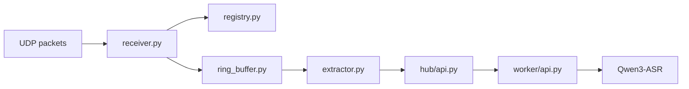

# PC Audio Hub

> UDP ingest, rolling audio buffer, HTTP query interface, and local `Qwen3-ASR` worker for the `ESP32-S3` microphone nodes.

## What The Hub Does

The hub is the PC-side runtime that turns a live PCM stream into queryable short-term memory:

- receives UDP packets from one or more nodes
- tracks nodes by `node_uuid`
- stores a rolling per-node ring buffer
- exports WAV clips by time range
- runs local ASR on extracted clips

## 🌊 Runtime Topology



## Implemented v1

| Capability | Status |
| --- | --- |
| UDP ingest | Implemented |
| Per-node ring buffer | Implemented |
| `/nodes` API | Implemented |
| `/query/audio` API | Implemented |
| async `/query/stt` job API | Implemented |
| `/jobs/<job_id>` API | Implemented |
| Local ASR worker | Implemented |
| Video support | Not implemented |

## Directory Layout

| Path | Purpose |
| --- | --- |
| `hub/` | UDP receiver, registry, extraction, HTTP query API |
| `worker/` | local HTTP ASR worker |
| `shared/` | WAV writing and shared constants |

## Install

From this directory:

```sh
python3 -m pip install -e .
```

This installs:

- `pc_hub`
- `qwen-asr`
- `torch`
- `transformers`
- `soundfile`

## Configuration

### Hub

| Variable | Default |
| --- | --- |
| `PC_HUB_BIND_HOST` | `127.0.0.1` |
| `PC_HUB_HTTP_PORT` | `8765` |
| `PC_HUB_UDP_HOST` | `0.0.0.0` |
| `PC_HUB_UDP_PORT` | `4000` |
| `PC_HUB_RING_MINUTES` | `10` |
| `PC_HUB_CLIP_DIR` | `Software/pc_hub/runtime/clips` |
| `PC_HUB_WORKER_URL` | `http://127.0.0.1:8766/transcribe` |
| `PC_HUB_CLIP_TTL_SECONDS` | `900` |
| `PC_HUB_MAX_QUERY_SECONDS` | `120` |
| `PC_HUB_STT_JOB_QUEUE_SIZE` | `16` |
| `PC_HUB_STT_JOB_TTL_SECONDS` | `900` |

### Worker

| Variable | Default |
| --- | --- |
| `PC_HUB_WORKER_HOST` | `127.0.0.1` |
| `PC_HUB_WORKER_PORT` | `8766` |
| `PC_HUB_ASR_MODEL` | `Qwen/Qwen3-ASR-0.6B` |
| `PC_HUB_ASR_LANGUAGE` | `zh` |
| `PC_HUB_ASR_DEVICE_MAP` | `mps` on Apple Silicon, otherwise `cpu` |
| `PC_HUB_ASR_DTYPE` | `float16` on Apple Silicon, otherwise `float32` |
| `PC_HUB_ASR_MAX_BATCH_SIZE` | `1` |
| `PC_HUB_ASR_MAX_NEW_TOKENS` | `512` |

## Recommended Local Settings

```sh
export PC_HUB_ASR_MODEL=Qwen/Qwen3-ASR-0.6B
export PC_HUB_ASR_LANGUAGE=zh
export PC_HUB_ASR_DEVICE_MAP=mps
export PC_HUB_ASR_DTYPE=float16
export PC_HUB_ASR_MAX_BATCH_SIZE=1
export PC_HUB_ASR_MAX_NEW_TOKENS=512
```

Notes:

- first run downloads weights into `~/.cache/huggingface/hub`
- `zh` and `en` are normalized internally to `Chinese` and `English`

## 🚀 Run

### Start the ASR worker

```sh
export PC_HUB_ASR_MODEL=Qwen/Qwen3-ASR-0.6B
export PC_HUB_ASR_LANGUAGE=zh
export PC_HUB_ASR_DEVICE_MAP=mps
export PC_HUB_ASR_DTYPE=float16
python3 -m worker.main
```

### Start the hub

```sh
export PC_HUB_BIND_HOST=127.0.0.1
export PC_HUB_HTTP_PORT=8765
export PC_HUB_UDP_HOST=0.0.0.0
export PC_HUB_UDP_PORT=4000
export PC_HUB_RING_MINUTES=10
export PC_HUB_WORKER_URL=http://127.0.0.1:8766/transcribe
export PC_HUB_CLIP_TTL_SECONDS=900
export PC_HUB_MAX_QUERY_SECONDS=120
export PC_HUB_STT_JOB_QUEUE_SIZE=16
export PC_HUB_STT_JOB_TTL_SECONDS=900
python3 -m hub.main
```

## API

### `GET /nodes`

Returns the currently seen nodes, keyed by `node_uuid`.

### `POST /query/audio`

```json
{
  "node_uuid": "esp32s3-a1b2c3d4e5f6",
  "start_time": 1710000000.1,
  "end_time": 1710000030.1
}
```

### `POST /query/stt`

Same request shape as `/query/audio`.

The hub:

1. validates the requested audio window
2. enqueues an STT job
3. returns a `job_id`

### `GET /jobs/<job_id>`

Returns the job status:

- `queued`
- `running`
- `succeeded`
- `failed`
- `expired`

When successful, the payload includes the clip path and ASR result.

## Timebase

The query timebase is:

- `pc_receive_time`

It is not the embedded packet timestamp.

## ✅ Verified Behavior

This hub has already been validated in two useful ways:

- direct worker transcription against local WAV input
- full end-to-end simulated ESP32 UDP upload, followed by async STT job execution

## Notes & Limits

- `segments` are currently empty for `Qwen3-ASR`
- this service is audio-only for now
- first ASR request is slower because model load and cache warm-up dominate latency
- clip files are temporary and are cleaned by TTL
