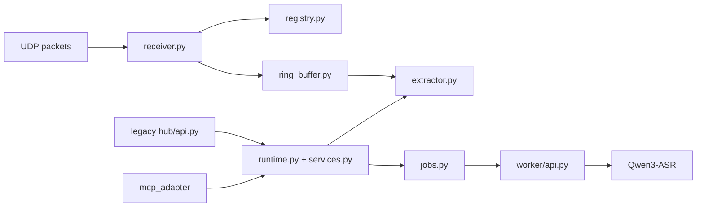

# PC Audio Hub

> UDP ingest, per-node rolling audio buffer, async STT jobs, a primary MCP entrypoint for AI agents, and a legacy HTTP compatibility API for the `ESP32-S3` microphone nodes.

## What The Hub Does

The hub is the PC-side runtime that turns a live PCM stream into queryable short-term audio memory:

- receives UDP packets from one or more nodes
- tracks nodes by `node_uuid`
- stores a rolling per-node ring buffer
- extracts WAV clips by time range
- submits async STT jobs against extracted clips
- exposes an MCP server as the preferred AI-facing interface

## 🌊 Runtime Topology



## Implemented v1

| Capability | Status |
| --- | --- |
| UDP ingest | Implemented |
| Per-node ring buffer | Implemented |
| HTTP MCP adapter | Implemented |
| Legacy `/nodes` API | Implemented, deprecated |
| Legacy `/query/audio` API | Implemented, deprecated |
| Legacy async `/query/stt` job API | Implemented, deprecated |
| Legacy `/jobs/<job_id>` API | Implemented, deprecated |
| Local ASR worker | Implemented |
| Video / vision pipeline integration | Not implemented |

## Directory Layout

| Path | Purpose |
| --- | --- |
| `hub/` | UDP receiver, registry, extraction, runtime, legacy HTTP API |
| `mcp_adapter/` | MCP server for AI agents |
| `worker/` | local HTTP ASR worker |
| `shared/` | WAV writing and shared constants |

## Install

From this directory:

```sh
python3 -m pip install -e .
```

For test tooling:

```sh
python3 -m pip install -e '.[test]'
```

This installs the editable `pc-audio-hub` package and its declared dependencies.

## Configuration

### Hub

| Variable | Default |
| --- | --- |
| `PC_HUB_BIND_HOST` | `127.0.0.1` |
| `PC_HUB_HTTP_PORT` | `8765` |
| `PC_HUB_ENABLE_LEGACY_HTTP` | `0` |
| `PC_HUB_UDP_HOST` | `0.0.0.0` |
| `PC_HUB_UDP_PORT` | `4000` |
| `PC_HUB_RING_MINUTES` | `10` |
| `PC_HUB_CLIP_DIR` | `Software/pc_hub/runtime/clips` |
| `PC_HUB_WORKER_URL` | `http://127.0.0.1:8766/transcribe` |
| `PC_HUB_CLIP_TTL_SECONDS` | `900` |
| `PC_HUB_MAX_QUERY_SECONDS` | `120` |
| `PC_HUB_STT_JOB_QUEUE_SIZE` | `16` |
| `PC_HUB_STT_JOB_TTL_SECONDS` | `900` |

### MCP

| Variable | Default |
| --- | --- |
| `PC_HUB_MCP_BIND_HOST` | `127.0.0.1` |
| `PC_HUB_MCP_PORT` | `8767` |
| `PC_HUB_MCP_PATH` | `/mcp` |

### Worker

| Variable | Default |
| --- | --- |
| `PC_HUB_WORKER_HOST` | `127.0.0.1` |
| `PC_HUB_WORKER_PORT` | `8766` |
| `PC_HUB_ASR_MODEL` | `Qwen/Qwen3-ASR-0.6B` |
| `PC_HUB_ASR_LANGUAGE` | `zh` |
| `PC_HUB_ASR_DEVICE_MAP` | `mps` on Apple Silicon, `auto` on Windows, otherwise `cpu` |
| `PC_HUB_ASR_DTYPE` | `float16` on Apple Silicon, otherwise `float32` |
| `PC_HUB_ASR_MAX_BATCH_SIZE` | `1` |
| `PC_HUB_ASR_MAX_NEW_TOKENS` | `512` |

## Recommended Local Settings

```sh
export PC_HUB_ASR_MODEL=Qwen/Qwen3-ASR-0.6B
export PC_HUB_ASR_LANGUAGE=zh
export PC_HUB_ASR_DEVICE_MAP=mps
export PC_HUB_ASR_DTYPE=float16
export PC_HUB_ASR_MAX_BATCH_SIZE=1
export PC_HUB_ASR_MAX_NEW_TOKENS=512
```

On Windows, `PC_HUB_ASR_DEVICE_MAP=auto` tries `cuda` first and falls back to `cpu` if CUDA is unavailable or model initialization fails.

Notes:

- first run downloads weights into `~/.cache/huggingface/hub`
- `zh` and `en` are normalized internally to `Chinese` and `English`

## 🚀 Run

### Start the ASR worker

```sh
export PC_HUB_ASR_MODEL=Qwen/Qwen3-ASR-0.6B
export PC_HUB_ASR_LANGUAGE=zh
export PC_HUB_ASR_DEVICE_MAP=auto
export PC_HUB_ASR_DTYPE=float32
python3 -m worker.main
```

### Start the MCP hub

```sh
export PC_HUB_MCP_BIND_HOST=127.0.0.1
export PC_HUB_MCP_PORT=8767
export PC_HUB_MCP_PATH=/mcp
python3 -m mcp_adapter.main
```

## Docker

Build and run the worker plus MCP hub with Docker Compose:

```sh
docker compose up --build
```

This publishes:

- UDP ingest on `4000/udp`
- legacy HTTP on `http://127.0.0.1:8765`
- MCP on `http://127.0.0.1:8767/mcp`

Notes:

- the Compose stack runs two containers: `worker` and `mcp_hub`
- clip files are stored in the named volume `clips`
- Hugging Face model cache is stored in the named volume `hf-cache`
- the Compose worker requests `gpus: all` and defaults `PC_HUB_ASR_DEVICE_MAP=cuda`
- if you want CPU-only inference, override `PC_HUB_ASR_DEVICE_MAP=cpu` and remove or override the GPU request
- first startup can take a while because the ASR model may need to be downloaded into the cache volume

### Start the legacy HTTP hub

```sh
export PC_HUB_BIND_HOST=127.0.0.1
export PC_HUB_HTTP_PORT=8765
export PC_HUB_UDP_HOST=0.0.0.0
export PC_HUB_UDP_PORT=4000
export PC_HUB_RING_MINUTES=10
export PC_HUB_WORKER_URL=http://127.0.0.1:8766/transcribe
export PC_HUB_CLIP_TTL_SECONDS=900
export PC_HUB_MAX_QUERY_SECONDS=120
export PC_HUB_STT_JOB_QUEUE_SIZE=16
export PC_HUB_STT_JOB_TTL_SECONDS=900
export PC_HUB_ENABLE_LEGACY_HTTP=1
python3 -m hub.main
```

## MCP Tools

The preferred AI-facing interface is the MCP server at `http://127.0.0.1:8767/mcp`.

It exposes these tools:

- `list_nodes`
- `submit_stt_job`
- `get_stt_job`

All query windows use `pc_receive_time`.

## Legacy HTTP API

The HTTP API remains available for compatibility, debugging, and manual verification. It is now deprecated and will be removed after the MCP path is stable.

### `GET /nodes`

Returns the currently seen nodes, keyed by `node_uuid`.

### `POST /query/audio`

```json
{
  "node_uuid": "esp32s3-a1b2c3d4e5f6",
  "start_time": 1710000000.1,
  "end_time": 1710000030.1
}
```

### `POST /query/stt`

Same request shape as `/query/audio`.

The hub:

1. validates the requested audio window
2. extracts a temporary WAV clip
3. enqueues an STT job
4. returns a `job_id`

### `GET /jobs/<job_id>`

Returns the job status:

- `queued`
- `running`
- `succeeded`
- `failed`
- `expired`

When successful, the payload includes the clip path and ASR result.
Completed jobs eventually transition to `expired`, and are later removed from the in-memory job table after an additional TTL window.

## Tests

Run the PC hub tests with:

```sh
python3 -m pytest -q
```

## Timebase

The query timebase is:

- `pc_receive_time`

It is not the embedded packet timestamp.

## ✅ Verified Behavior

This hub has already been validated in two useful ways:

- direct worker transcription against local WAV input
- full end-to-end simulated ESP32 UDP upload, followed by async STT job execution

## Notes & Limits

- `segments` are currently empty for `Qwen3-ASR`
- this service is audio-only for now
- first ASR request is slower because model load and cache warm-up dominate latency
- clip files are temporary and are cleaned by TTL
- `/query/stt` is asynchronous, but audio extraction itself still happens at submission time
- query windows are bounded by `PC_HUB_MAX_QUERY_SECONDS`
- AI agents should prefer MCP over the legacy HTTP query API
