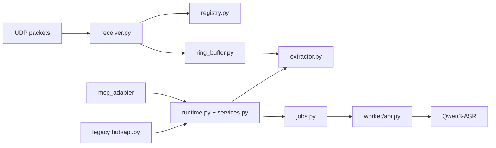

# PC Audio Hub

> UDP ingest, per-node rolling audio buffer, async STT jobs, MCP-first access, and a deprecated legacy HTTP compatibility layer.

中文说明见：[README.zh-CN.md](README.zh-CN.md)

## Runtime Topology



## What It Does

- receives UDP audio packets from one or more nodes
- tracks nodes by `node_uuid`
- stores recent audio in per-node rolling buffers
- extracts WAV clips by `pc_receive_time`
- submits async STT jobs to the local worker
- exposes MCP as the preferred AI-facing interface
- keeps a deprecated legacy HTTP API for compatibility and manual debugging

Recommended startup path:

1. `python3 -m worker.main`
2. `python3 -m mcp_adapter.main`

The legacy HTTP API is optional and disabled by default.

## Install

```sh
python3 -m pip install -e .
```

For tests:

```sh
python3 -m pip install -e '.[test]'
```

## Configuration

### Core runtime

| Variable | Default |
| --- | --- |
| `PC_HUB_BIND_HOST` | `127.0.0.1` |
| `PC_HUB_HTTP_PORT` | `8765` |
| `PC_HUB_ENABLE_LEGACY_HTTP` | `0` |
| `PC_HUB_UDP_HOST` | `0.0.0.0` |
| `PC_HUB_UDP_PORT` | `4000` |
| `PC_HUB_RING_MINUTES` | `10` |
| `PC_HUB_CLIP_DIR` | `Software/pc_hub/runtime/clips` |
| `PC_HUB_WORKER_URL` | `http://127.0.0.1:8766/transcribe` |
| `PC_HUB_CLIP_TTL_SECONDS` | `900` |
| `PC_HUB_MAX_QUERY_SECONDS` | `120` |
| `PC_HUB_STT_JOB_QUEUE_SIZE` | `16` |
| `PC_HUB_STT_JOB_TTL_SECONDS` | `900` |

### MCP

| Variable | Default |
| --- | --- |
| `PC_HUB_MCP_BIND_HOST` | `127.0.0.1` |
| `PC_HUB_MCP_PORT` | `8767` |
| `PC_HUB_MCP_PATH` | `/mcp` |

### Worker

| Variable | Default |
| --- | --- |
| `PC_HUB_WORKER_HOST` | `127.0.0.1` |
| `PC_HUB_WORKER_PORT` | `8766` |
| `PC_HUB_ASR_MODEL` | `Qwen/Qwen3-ASR-0.6B` |
| `PC_HUB_ASR_LANGUAGE` | `zh` |
| `PC_HUB_ASR_DEVICE_MAP` | `mps` on Apple Silicon, `auto` on Windows, otherwise `cpu` |
| `PC_HUB_ASR_DTYPE` | `float16` on Apple Silicon, otherwise `float32` |
| `PC_HUB_ASR_MAX_BATCH_SIZE` | `1` |
| `PC_HUB_ASR_MAX_NEW_TOKENS` | `512` |

### Home Assistant MQTT

| Variable | Default |
| --- | --- |
| `PC_HUB_MQTT_HOST` | disabled when empty |
| `PC_HUB_MQTT_PORT` | `1883` |
| `PC_HUB_MQTT_USERNAME` | unset |
| `PC_HUB_MQTT_PASSWORD` | unset |
| `PC_HUB_MQTT_CLIENT_ID` | `pc-audio-hub` |
| `PC_HUB_HA_DISCOVERY_PREFIX` | `homeassistant` |
| `PC_HUB_MQTT_TOPIC_PREFIX` | `mic_hub` |
| `PC_HUB_NODE_OFFLINE_SECONDS` | `30` |

## Run

### Recommended path

```sh
export PC_HUB_ASR_MODEL=Qwen/Qwen3-ASR-0.6B
export PC_HUB_ASR_LANGUAGE=zh
export PC_HUB_ASR_DEVICE_MAP=mps
export PC_HUB_ASR_DTYPE=float16
python3 -m worker.main
```

```sh
export PC_HUB_MCP_BIND_HOST=127.0.0.1
export PC_HUB_MCP_PORT=8767
export PC_HUB_MCP_PATH=/mcp
python3 -m mcp_adapter.main
```

Preferred endpoint:

```text
http://127.0.0.1:8767/mcp
```

MCP tools:

- `list_nodes`
- `submit_stt_job`
- `get_stt_job`

### Optional legacy path

```sh
export PC_HUB_BIND_HOST=127.0.0.1
export PC_HUB_HTTP_PORT=8765
export PC_HUB_UDP_HOST=0.0.0.0
export PC_HUB_UDP_PORT=4000
export PC_HUB_RING_MINUTES=10
export PC_HUB_WORKER_URL=http://127.0.0.1:8766/transcribe
export PC_HUB_CLIP_TTL_SECONDS=900
export PC_HUB_MAX_QUERY_SECONDS=120
export PC_HUB_STT_JOB_QUEUE_SIZE=16
export PC_HUB_STT_JOB_TTL_SECONDS=900
export PC_HUB_ENABLE_LEGACY_HTTP=1
python3 -m hub.main
```

## Docker

```sh
docker compose up --build
```

Published ports:

- `4000/udp`
- `8765` for legacy HTTP
- `8767` for MCP

Notes:

- the Compose stack runs `worker` and `mcp_hub`
- the worker defaults to `gpus: all` and `PC_HUB_ASR_DEVICE_MAP=cuda`
- on macOS, Docker Desktop does not expose Apple `mps`, so Compose is not the default Mac path
- use `PC_HUB_ASR_DEVICE_MAP=cpu` if you want CPU-only inference in containers

## More Detail

- [../../docs/verification.md](../../docs/verification.md)
  Worker smoke tests, simulated uplink status, and legacy HTTP verification.
- [../../docs/protocols.md](../../docs/protocols.md)
  Timebase, legacy API contract, MQTT exposure, and wire-level integration notes.

## Notes

- All query windows use `pc_receive_time`.
- `segments` are currently empty for `Qwen3-ASR`.
- Clip files are temporary and cleaned by TTL.
- The service is audio-only for now.
