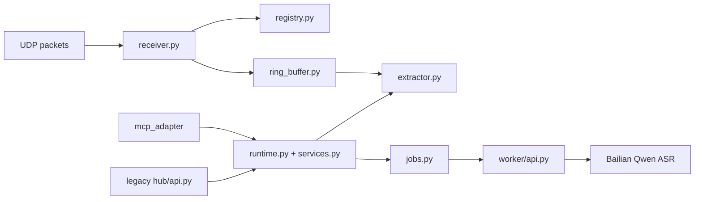

# PC Audio Hub

> UDP ingest, per-node rolling audio buffer, async STT jobs, MCP-first access, and a deprecated legacy HTTP compatibility layer.

中文说明见：[README.zh-CN.md](README.zh-CN.md)

## Runtime Topology


```mermaid
flowchart LR
  udp["UDP packets"] --> recv["receiver.py"]
  recv --> reg["registry.py"]
  recv --> ring["ring_buffer.py"]
  ring --> ext["extractor.py"]
  runtime["runtime.py + services.py"] --> ext
  runtime --> jobs["jobs.py"]
  mcp["mcp_adapter"] --> runtime
  legacy["legacy hub/api.py"] --> runtime
  jobs --> worker["worker/api.py"]
  worker --> asr["Bailian Qwen ASR"]
```

## What It Does

- receives UDP audio packets from one or more nodes
- tracks nodes by `node_uuid`
- stores recent audio in per-node rolling buffers
- extracts WAV clips by `pc_receive_time`
- submits async STT jobs to the worker, which uses Alibaba Cloud Model Studio by default
- exposes MCP as the preferred AI-facing interface
- keeps a deprecated legacy HTTP API for compatibility and manual debugging

Recommended startup path:

1. `python3 -m worker.main`
2. `python3 -m mcp_adapter.main`

The legacy HTTP API is optional and disabled by default.

## Install

```powershell
uv sync
```

For tests:

```powershell
uv sync --extra test
```

## Configuration

### Core runtime

| Variable | Default |
| --- | --- |
| `PC_HUB_BIND_HOST` | `127.0.0.1` |
| `PC_HUB_HTTP_PORT` | `8765` |
| `PC_HUB_ENABLE_LEGACY_HTTP` | `0` |
| `PC_HUB_UDP_HOST` | `0.0.0.0` |
| `PC_HUB_UDP_PORT` | `4000` |
| `PC_HUB_RING_MINUTES` | `10` |
| `PC_HUB_CLIP_DIR` | `Software/pc_hub/runtime/clips` |
| `PC_HUB_WORKER_URL` | `http://127.0.0.1:8766/transcribe` |
| `PC_HUB_CLIP_TTL_SECONDS` | `900` |
| `PC_HUB_MAX_QUERY_SECONDS` | `120` |
| `PC_HUB_STT_JOB_QUEUE_SIZE` | `16` |
| `PC_HUB_STT_JOB_TTL_SECONDS` | `900` |

### MCP

| Variable | Default |
| --- | --- |
| `PC_HUB_MCP_BIND_HOST` | `127.0.0.1` |
| `PC_HUB_MCP_PORT` | `8767` |
| `PC_HUB_MCP_PATH` | `/mcp` |

### Worker

| Variable | Default |
| --- | --- |
| `PC_HUB_WORKER_HOST` | `127.0.0.1` |
| `PC_HUB_WORKER_PORT` | `8766` |
| `PC_HUB_ASR_PROVIDER` | `bailian` |
| `PC_HUB_ASR_LANGUAGE` | `zh` |
| `PC_HUB_BAILIAN_API_KEY` | unset; falls back to `DASHSCOPE_API_KEY` |
| `PC_HUB_BAILIAN_BASE_URL` | unset; uses a workspace domain when configured, otherwise the legacy DashScope-compatible domain |
| `PC_HUB_BAILIAN_WORKSPACE_ID` | unset |
| `PC_HUB_BAILIAN_REGION` | `cn-beijing` |
| `PC_HUB_BAILIAN_MODEL` | `qwen3-asr-flash` |
| `PC_HUB_BAILIAN_ENABLE_ITN` | `0` |
| `PC_HUB_BAILIAN_TIMEOUT_SECONDS` | `60` |
| `PC_HUB_BAILIAN_MAX_AUDIO_BYTES` | `7500000` |

### Home Assistant MQTT

| Variable | Default |
| --- | --- |
| `PC_HUB_MQTT_HOST` | disabled when empty |
| `PC_HUB_MQTT_PORT` | `1883` |
| `PC_HUB_MQTT_USERNAME` | unset |
| `PC_HUB_MQTT_PASSWORD` | unset |
| `PC_HUB_MQTT_CLIENT_ID` | `pc-audio-hub` |
| `PC_HUB_HA_DISCOVERY_PREFIX` | `homeassistant` |
| `PC_HUB_MQTT_TOPIC_PREFIX` | `mic_hub` |
| `PC_HUB_NODE_OFFLINE_SECONDS` | `30` |

## Run

### Recommended path

```powershell
$env:DASHSCOPE_API_KEY="your-api-key"
$env:PC_HUB_ASR_PROVIDER="bailian"
$env:PC_HUB_ASR_LANGUAGE="zh"
uv run python -m worker.main
```

To use the Model Studio workspace-specific domain recommended by Alibaba Cloud, set `PC_HUB_BAILIAN_WORKSPACE_ID`:

```powershell
$env:PC_HUB_BAILIAN_WORKSPACE_ID="your-workspace-id"
$env:PC_HUB_BAILIAN_REGION="cn-beijing"
```

```powershell
$env:PC_HUB_MCP_BIND_HOST="127.0.0.1"
$env:PC_HUB_MCP_PORT="8767"
$env:PC_HUB_MCP_PATH="/mcp"
uv run python -m mcp_adapter.main
```

Preferred endpoint:

```text
http://127.0.0.1:8767/mcp
```

MCP tools:

- `list_nodes`
- `submit_stt_job`
- `get_stt_job`

### Optional legacy path

```powershell
$env:PC_HUB_BIND_HOST="127.0.0.1"
$env:PC_HUB_HTTP_PORT="8765"
$env:PC_HUB_UDP_HOST="0.0.0.0"
$env:PC_HUB_UDP_PORT="4000"
$env:PC_HUB_RING_MINUTES="10"
$env:PC_HUB_WORKER_URL="http://127.0.0.1:8766/transcribe"
$env:PC_HUB_CLIP_TTL_SECONDS="900"
$env:PC_HUB_MAX_QUERY_SECONDS="120"
$env:PC_HUB_STT_JOB_QUEUE_SIZE="16"
$env:PC_HUB_STT_JOB_TTL_SECONDS="900"
$env:PC_HUB_ENABLE_LEGACY_HTTP="1"
uv run python -m hub.main
```

### Optional local ASR

The local `Qwen3-ASR` backend remains available as an explicit opt-in path. Default installs and Docker runs no longer require `torch` or a compatible GPU. To use local inference:

```powershell
uv sync --extra local-asr
$env:PC_HUB_ASR_PROVIDER="local-qwen3"
$env:PC_HUB_ASR_MODEL="Qwen/Qwen3-ASR-0.6B"
$env:PC_HUB_ASR_DEVICE_MAP="auto"
$env:PC_HUB_ASR_DTYPE="float32"
uv run python -m worker.main
```

## Docker

```sh
docker compose up --build
```

Published ports:

- `4000/udp`
- `8765` for legacy HTTP
- `8767` for MCP

Notes:

- the Compose stack runs `worker` and `mcp_hub`
- the worker defaults to Bailian cloud ASR, so pass `DASHSCOPE_API_KEY` or `PC_HUB_BAILIAN_API_KEY`
- set `PC_HUB_BAILIAN_WORKSPACE_ID` to use the Model Studio workspace-specific domain
- Compose no longer requests a GPU by default; for in-container local inference, install the `local-asr` extra and adjust the image explicitly

## More Detail

- [../../docs/verification.md](../../docs/verification.md)
  Worker smoke tests, simulated uplink status, and legacy HTTP verification.
- [../../docs/protocols.md](../../docs/protocols.md)
  Timebase, legacy API contract, MQTT exposure, and wire-level integration notes.

## Notes

- All query windows use `pc_receive_time`.
- `segments` are currently empty for Bailian OpenAI-compatible ASR.
- Clip files are temporary and cleaned by TTL.
- The service is audio-only for now.
