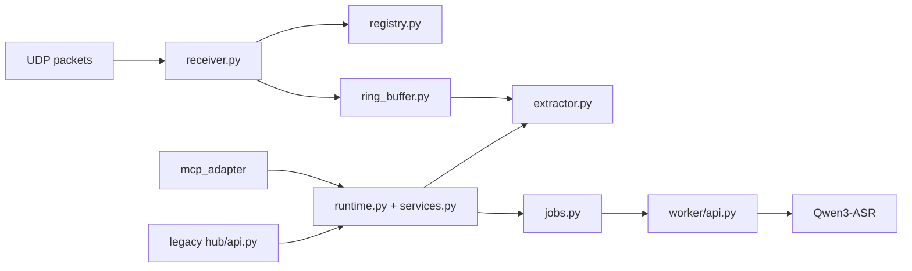

# PC Audio Hub

> 面向 `ESP32-S3` 麦克风节点的 UDP 接收、按节点滚动音频缓存、异步 STT 任务、MCP 主入口，以及已废弃的 legacy HTTP 兼容层。

English version: [README.md](README.md)

## 运行拓扑



## 它负责什么

- 接收一个或多个节点的 UDP 音频包
- 通过 `node_uuid` 跟踪节点
- 为每个节点维护滚动音频缓冲
- 按 `pc_receive_time` 提取 WAV 片段
- 把异步 STT 任务提交给本地 worker
- 默认通过 MCP 暴露 AI 访问接口
- 保留一个已废弃的 legacy HTTP API 用于兼容和手动调试

推荐启动顺序：

1. `python3 -m worker.main`
2. `python3 -m mcp_adapter.main`

legacy HTTP 是可选路径，而且默认关闭。

## 安装

```sh
python3 -m pip install -e .
```

如需测试依赖：

```sh
python3 -m pip install -e '.[test]'
```

## 配置

### 核心运行参数

| 变量 | 默认值 |
| --- | --- |
| `PC_HUB_BIND_HOST` | `127.0.0.1` |
| `PC_HUB_HTTP_PORT` | `8765` |
| `PC_HUB_ENABLE_LEGACY_HTTP` | `0` |
| `PC_HUB_UDP_HOST` | `0.0.0.0` |
| `PC_HUB_UDP_PORT` | `4000` |
| `PC_HUB_RING_MINUTES` | `10` |
| `PC_HUB_CLIP_DIR` | `Software/pc_hub/runtime/clips` |
| `PC_HUB_WORKER_URL` | `http://127.0.0.1:8766/transcribe` |
| `PC_HUB_CLIP_TTL_SECONDS` | `900` |
| `PC_HUB_MAX_QUERY_SECONDS` | `120` |
| `PC_HUB_STT_JOB_QUEUE_SIZE` | `16` |
| `PC_HUB_STT_JOB_TTL_SECONDS` | `900` |

### MCP

| 变量 | 默认值 |
| --- | --- |
| `PC_HUB_MCP_BIND_HOST` | `127.0.0.1` |
| `PC_HUB_MCP_PORT` | `8767` |
| `PC_HUB_MCP_PATH` | `/mcp` |

### Worker

| 变量 | 默认值 |
| --- | --- |
| `PC_HUB_WORKER_HOST` | `127.0.0.1` |
| `PC_HUB_WORKER_PORT` | `8766` |
| `PC_HUB_ASR_MODEL` | `Qwen/Qwen3-ASR-0.6B` |
| `PC_HUB_ASR_LANGUAGE` | `zh` |
| `PC_HUB_ASR_DEVICE_MAP` | Apple Silicon 上为 `mps`，Windows 上为 `auto`，其他平台为 `cpu` |
| `PC_HUB_ASR_DTYPE` | Apple Silicon 上为 `float16`，否则为 `float32` |
| `PC_HUB_ASR_MAX_BATCH_SIZE` | `1` |
| `PC_HUB_ASR_MAX_NEW_TOKENS` | `512` |

### Home Assistant MQTT

| 变量 | 默认值 |
| --- | --- |
| `PC_HUB_MQTT_HOST` | 留空时禁用 |
| `PC_HUB_MQTT_PORT` | `1883` |
| `PC_HUB_MQTT_USERNAME` | 未设置 |
| `PC_HUB_MQTT_PASSWORD` | 未设置 |
| `PC_HUB_MQTT_CLIENT_ID` | `pc-audio-hub` |
| `PC_HUB_HA_DISCOVERY_PREFIX` | `homeassistant` |
| `PC_HUB_MQTT_TOPIC_PREFIX` | `mic_hub` |
| `PC_HUB_NODE_OFFLINE_SECONDS` | `30` |

## 运行

### 推荐路径

```sh
export PC_HUB_ASR_MODEL=Qwen/Qwen3-ASR-0.6B
export PC_HUB_ASR_LANGUAGE=zh
export PC_HUB_ASR_DEVICE_MAP=mps
export PC_HUB_ASR_DTYPE=float16
python3 -m worker.main
```

```sh
export PC_HUB_MCP_BIND_HOST=127.0.0.1
export PC_HUB_MCP_PORT=8767
export PC_HUB_MCP_PATH=/mcp
python3 -m mcp_adapter.main
```

推荐入口：

```text
http://127.0.0.1:8767/mcp
```

当前 MCP 工具：

- `list_nodes`
- `submit_stt_job`
- `get_stt_job`

### 可选 legacy 路径

```sh
export PC_HUB_BIND_HOST=127.0.0.1
export PC_HUB_HTTP_PORT=8765
export PC_HUB_UDP_HOST=0.0.0.0
export PC_HUB_UDP_PORT=4000
export PC_HUB_RING_MINUTES=10
export PC_HUB_WORKER_URL=http://127.0.0.1:8766/transcribe
export PC_HUB_CLIP_TTL_SECONDS=900
export PC_HUB_MAX_QUERY_SECONDS=120
export PC_HUB_STT_JOB_QUEUE_SIZE=16
export PC_HUB_STT_JOB_TTL_SECONDS=900
export PC_HUB_ENABLE_LEGACY_HTTP=1
python3 -m hub.main
```

## Docker

```sh
docker compose up --build
```

暴露端口：

- `4000/udp`
- `8765` 给 legacy HTTP
- `8767` 给 MCP

说明：

- Compose 会启动 `worker` 和 `mcp_hub`
- `worker` 默认申请 `gpus: all`，并使用 `PC_HUB_ASR_DEVICE_MAP=cuda`
- 在 macOS 上，Docker Desktop 不会把 Apple `mps` 暴露给容器，因此 Compose 不是 Mac 默认路径
- 如果你要容器内纯 CPU 推理，请使用 `PC_HUB_ASR_DEVICE_MAP=cpu`

## 继续阅读

- [../../docs/verification.zh-CN.md](../../docs/verification.zh-CN.md)
  Worker 冒烟测试、模拟上行验证和 legacy HTTP 验证。
- [../../docs/protocols.zh-CN.md](../../docs/protocols.zh-CN.md)
  时间基准、legacy API、MQTT 暴露和对外接入约定。

## 备注

- 所有查询窗口都使用 `pc_receive_time`。
- `Qwen3-ASR` 当前返回的 `segments` 为空。
- clip 文件是临时产物，会按 TTL 清理。
- 当前服务仍然只处理音频。
