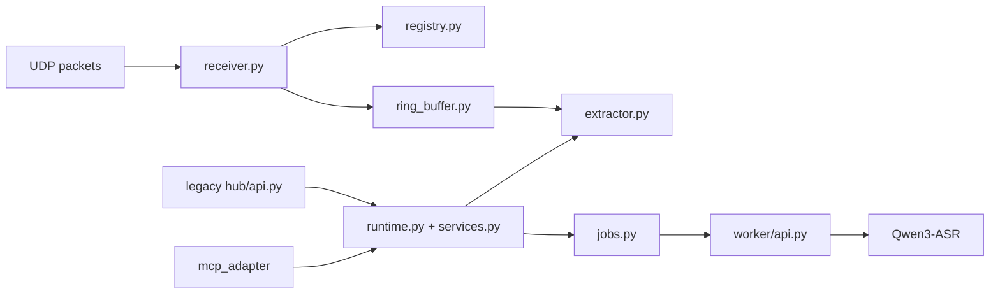

# PC Audio Hub

> 面向 `ESP32-S3` 麦克风节点的 UDP 接收、按节点滚动音频缓存、异步 STT 任务、供 AI agent 使用的 MCP 主入口，以及兼容期内保留的 legacy HTTP API。

English version: [README.md](README.md)

## Hub 做什么

Hub 是 PC 侧的运行时，它把实时 PCM 流转成可查询的短时音频记忆：

- 接收一个或多个节点的 UDP 音频包
- 通过 `node_uuid` 追踪节点
- 为每个节点维护滚动 Ring Buffer
- 按时间窗导出 WAV clip
- 针对提取出的音频片段提交异步 STT 任务
- 通过 MCP server 向 AI agent 暴露查询能力
- 通过 MQTT 向 Home Assistant 发布自动发现与聚合节点状态

## 🌊 运行拓扑



## 当前已实现

| 能力 | 状态 |
| --- | --- |
| UDP 接收 | 已实现 |
| 按节点 Ring Buffer | 已实现 |
| HTTP MCP adapter | 已实现 |
| Legacy `/nodes` API | 已实现，已废弃 |
| Legacy `/query/audio` API | 已实现，已废弃 |
| Legacy 异步 `/query/stt` job API | 已实现，已废弃 |
| Legacy `/jobs/<job_id>` API | 已实现，已废弃 |
| 本地 ASR worker | 已实现 |
| Home Assistant MQTT bridge | 已实现 |
| 视频 / 视觉链路集成 | 未实现 |

## 目录结构

| 路径 | 用途 |
| --- | --- |
| `hub/` | UDP receiver、registry、extraction、runtime、legacy HTTP API |
| `mcp_adapter/` | 面向 AI agent 的 MCP server |
| `worker/` | 本地 HTTP ASR worker |
| `shared/` | WAV 写入与共享常量 |

## 安装

在当前目录执行：

```sh
python3 -m pip install -e .
```

如果要安装测试工具：

```sh
python3 -m pip install -e '.[test]'
```

这会安装可编辑模式的 `pc-audio-hub` 包及其声明的依赖。

## 配置

### Hub

| 变量 | 默认值 |
| --- | --- |
| `PC_HUB_BIND_HOST` | `127.0.0.1` |
| `PC_HUB_HTTP_PORT` | `8765` |
| `PC_HUB_ENABLE_LEGACY_HTTP` | `0` |
| `PC_HUB_UDP_HOST` | `0.0.0.0` |
| `PC_HUB_UDP_PORT` | `4000` |
| `PC_HUB_RING_MINUTES` | `10` |
| `PC_HUB_CLIP_DIR` | `Software/pc_hub/runtime/clips` |
| `PC_HUB_WORKER_URL` | `http://127.0.0.1:8766/transcribe` |
| `PC_HUB_CLIP_TTL_SECONDS` | `900` |
| `PC_HUB_MAX_QUERY_SECONDS` | `120` |
| `PC_HUB_STT_JOB_QUEUE_SIZE` | `16` |
| `PC_HUB_STT_JOB_TTL_SECONDS` | `900` |

### Home Assistant MQTT

| 变量 | 默认值 |
| --- | --- |
| `PC_HUB_MQTT_HOST` | 留空时禁用 |
| `PC_HUB_MQTT_PORT` | `1883` |
| `PC_HUB_MQTT_USERNAME` | 未设置 |
| `PC_HUB_MQTT_PASSWORD` | 未设置 |
| `PC_HUB_MQTT_CLIENT_ID` | `pc-audio-hub` |
| `PC_HUB_HA_DISCOVERY_PREFIX` | `homeassistant` |
| `PC_HUB_MQTT_TOPIC_PREFIX` | `mic_hub` |
| `PC_HUB_NODE_OFFLINE_SECONDS` | `30` |

### MCP

| Variable | Default |
| --- | --- |
| `PC_HUB_MCP_BIND_HOST` | `127.0.0.1` |
| `PC_HUB_MCP_PORT` | `8767` |
| `PC_HUB_MCP_PATH` | `/mcp` |

### Worker

| 变量 | 默认值 |
| --- | --- |
| `PC_HUB_WORKER_HOST` | `127.0.0.1` |
| `PC_HUB_WORKER_PORT` | `8766` |
| `PC_HUB_ASR_MODEL` | `Qwen/Qwen3-ASR-0.6B` |
| `PC_HUB_ASR_LANGUAGE` | `zh` |
| `PC_HUB_ASR_DEVICE_MAP` | Apple Silicon 上为 `mps`，Windows 上为 `auto`，其他平台为 `cpu` |
| `PC_HUB_ASR_DTYPE` | Apple Silicon 上为 `float16`，否则为 `float32` |
| `PC_HUB_ASR_MAX_BATCH_SIZE` | `1` |
| `PC_HUB_ASR_MAX_NEW_TOKENS` | `512` |

## 推荐本地设置

```sh
export PC_HUB_ASR_MODEL=Qwen/Qwen3-ASR-0.6B
export PC_HUB_ASR_LANGUAGE=zh
export PC_HUB_ASR_DEVICE_MAP=mps
export PC_HUB_ASR_DTYPE=float16
export PC_HUB_ASR_MAX_BATCH_SIZE=1
export PC_HUB_ASR_MAX_NEW_TOKENS=512
```

在 Windows 上，`PC_HUB_ASR_DEVICE_MAP=auto` 会先尝试 `cuda`，如果 CUDA 不可用或模型初始化失败，再回退到 `cpu`。

说明：

- 首次运行会把模型权重下载到 `~/.cache/huggingface/hub`
- `zh` 和 `en` 会在内部标准化成 `Chinese` 和 `English`

## 🚀 运行

### 启动 ASR worker

```sh
export PC_HUB_ASR_MODEL=Qwen/Qwen3-ASR-0.6B
export PC_HUB_ASR_LANGUAGE=zh
export PC_HUB_ASR_DEVICE_MAP=auto
export PC_HUB_ASR_DTYPE=float32
python3 -m worker.main
```

### 启动 MCP Hub

```sh
export PC_HUB_MCP_BIND_HOST=127.0.0.1
export PC_HUB_MCP_PORT=8767
export PC_HUB_MCP_PATH=/mcp
export PC_HUB_MQTT_HOST=127.0.0.1
export PC_HUB_MQTT_PORT=1883
python3 -m mcp_adapter.main
```

启用 MQTT 后，Hub 会在 `homeassistant/...` 下发布 Home Assistant discovery，并在 `mic_hub/...` 下发布 Hub 自己维护的聚合状态。

第一版在 Home Assistant 中只呈现一个 Hub 设备，下面挂载这些实体：

- Hub 在线状态
- 已见 Node 总数
- 在线 Node 总数
- 最后一次发布时间
- 每个 Node 的在线状态
- 每个 Node 的 `node_id`
- 每个 Node 的包统计
- 每个 Node 的 `开始 streaming`、`停止 streaming` 和 `restart` 按钮

控制实体直接复用节点固件现有的 MQTT 命令 topic：

- `mic/<node_uuid>/cmd/streaming/set`，payload 为 `ON` 或 `OFF`
- `mic/<node_uuid>/cmd/restart`

## Docker

使用 Docker Compose 同时启动 `worker` 和 MCP Hub：

```sh
docker compose up --build
```

这会发布以下端口：

- UDP 接收：`4000/udp`
- 兼容 HTTP API：`http://127.0.0.1:8765`
- MCP：`http://127.0.0.1:8767/mcp`

说明：

- Compose 默认启动两个容器：`worker` 和 `mcp_hub`
- clip 文件保存在命名卷 `clips`
- Hugging Face 模型缓存保存在命名卷 `hf-cache`
- Compose 中的 `worker` 默认申请 `gpus: all`，并默认使用 `PC_HUB_ASR_DEVICE_MAP=cuda`
- 如果你要改成纯 CPU 推理，请把 `PC_HUB_ASR_DEVICE_MAP` 覆盖为 `cpu`，并移除或覆盖 GPU 申请
- 首次启动可能较慢，因为 ASR 模型可能需要先下载到缓存卷

### 启动 legacy HTTP Hub

```sh
export PC_HUB_BIND_HOST=127.0.0.1
export PC_HUB_HTTP_PORT=8765
export PC_HUB_UDP_HOST=0.0.0.0
export PC_HUB_UDP_PORT=4000
export PC_HUB_RING_MINUTES=10
export PC_HUB_WORKER_URL=http://127.0.0.1:8766/transcribe
export PC_HUB_CLIP_TTL_SECONDS=900
export PC_HUB_MAX_QUERY_SECONDS=120
export PC_HUB_STT_JOB_QUEUE_SIZE=16
export PC_HUB_STT_JOB_TTL_SECONDS=900
export PC_HUB_ENABLE_LEGACY_HTTP=1
python3 -m hub.main
```

## MCP Tools

推荐给 AI agent 使用的入口是 `http://127.0.0.1:8767/mcp` 上的 MCP server。

它暴露这些工具：

- `list_nodes`
- `submit_stt_job`
- `get_stt_job`

所有查询窗口都使用 `pc_receive_time`。

## Legacy HTTP API

HTTP API 仍然保留，用于兼容、调试和人工验证，但现在已经进入废弃阶段，等 MCP 路径稳定后会移除。

### `GET /nodes`

返回当前已见过的节点列表，主键为 `node_uuid`。

### `POST /query/audio`

```json
{
  "node_uuid": "esp32s3-a1b2c3d4e5f6",
  "start_time": 1710000000.1,
  "end_time": 1710000030.1
}
```

### `POST /query/stt`

请求结构与 `/query/audio` 相同。

Hub 会：

1. 校验查询窗口
2. 先提取一个临时 WAV 音频片段
3. 再把 STT 任务放入队列
4. 返回一个 `job_id`

### `GET /jobs/<job_id>`

返回任务状态：

- `queued`
- `running`
- `succeeded`
- `failed`
- `expired`

成功时，返回内容中会包含 clip 路径和 ASR 结果。任务完成一段时间后会先进入 `expired`，再在额外一个 TTL 窗口后从内存中的任务表里移除。

## 测试

运行 PC Hub 测试：

```sh
python3 -m pytest -q
```

## 时间基准

当前查询使用的时间轴是：

- `pc_receive_time`

而不是固件包头里嵌入的设备时间戳。

## ✅ 已验证行为

这个 hub 已经做过两类有价值的验证：

- 对本地 WAV 输入做直接 worker 转写
- 用模拟 ESP32 UDP 上传跑通端到端异步 STT job

## 注意事项与限制

- `segments` 目前对 `Qwen3-ASR` 仍为空
- 当前服务仍是纯音频
- 首次 ASR 请求会更慢，因为模型加载和缓存预热占主要延迟
- clip 文件是临时产物，会通过 TTL 自动清理
- `/query/stt` 是异步任务模式，但音频提取本身仍发生在提交阶段
- 查询窗口受 `PC_HUB_MAX_QUERY_SECONDS` 限制
- AI agent 应优先使用 MCP，而不是 legacy HTTP 查询接口
