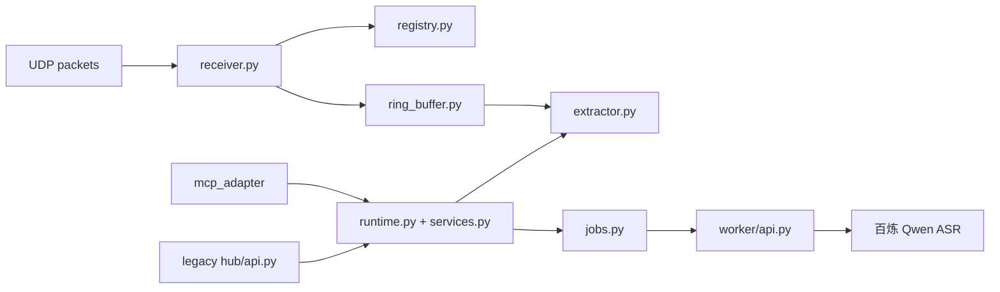

# PC Audio Hub

> 面向 `ESP32-S3` 麦克风节点的 UDP 接收、按节点滚动音频缓存、异步 STT 任务、MCP 主入口，以及已废弃的 legacy HTTP 兼容层。

English version: [README.md](README.md)

## 运行拓扑


```mermaid
flowchart LR
  udp["UDP packets"] --> recv["receiver.py"]
  recv --> reg["registry.py"]
  recv --> ring["ring_buffer.py"]
  ring --> ext["extractor.py"]
  runtime["runtime.py + services.py"] --> ext
  runtime --> jobs["jobs.py"]
  mcp["mcp_adapter"] --> runtime
  legacy["legacy hub/api.py"] --> runtime
  jobs --> worker["worker/api.py"]
  worker --> asr["百炼 Qwen ASR"]
```

## 它负责什么

- 接收一个或多个节点的 UDP 音频包
- 通过 `node_uuid` 跟踪节点
- 为每个节点维护滚动音频缓冲
- 按 `pc_receive_time` 提取 WAV 片段
- 把异步 STT 任务提交给 worker，默认由阿里云百炼完成 ASR
- 默认通过 MCP 暴露 AI 访问接口
- 保留一个已废弃的 legacy HTTP API 用于兼容和手动调试

推荐启动顺序：

1. `python3 -m worker.main`
2. `python3 -m mcp_adapter.main`

legacy HTTP 是可选路径，而且默认关闭。

## 安装

```powershell
uv sync
```

如需测试依赖：

```powershell
uv sync --extra test
```

## 配置

### 核心运行参数

| 变量 | 默认值 |
| --- | --- |
| `PC_HUB_BIND_HOST` | `127.0.0.1` |
| `PC_HUB_HTTP_PORT` | `8765` |
| `PC_HUB_ENABLE_LEGACY_HTTP` | `0` |
| `PC_HUB_UDP_HOST` | `0.0.0.0` |
| `PC_HUB_UDP_PORT` | `4000` |
| `PC_HUB_RING_MINUTES` | `10` |
| `PC_HUB_CLIP_DIR` | `Software/pc_hub/runtime/clips` |
| `PC_HUB_WORKER_URL` | `http://127.0.0.1:8766/transcribe` |
| `PC_HUB_CLIP_TTL_SECONDS` | `900` |
| `PC_HUB_MAX_QUERY_SECONDS` | `120` |
| `PC_HUB_STT_JOB_QUEUE_SIZE` | `16` |
| `PC_HUB_STT_JOB_TTL_SECONDS` | `900` |

### MCP

| 变量 | 默认值 |
| --- | --- |
| `PC_HUB_MCP_BIND_HOST` | `127.0.0.1` |
| `PC_HUB_MCP_PORT` | `8767` |
| `PC_HUB_MCP_PATH` | `/mcp` |

### Worker

| 变量 | 默认值 |
| --- | --- |
| `PC_HUB_WORKER_HOST` | `127.0.0.1` |
| `PC_HUB_WORKER_PORT` | `8766` |
| `PC_HUB_ASR_PROVIDER` | `bailian` |
| `PC_HUB_ASR_LANGUAGE` | `zh` |
| `PC_HUB_BAILIAN_API_KEY` | 未设置，未设置时回退到 `DASHSCOPE_API_KEY` |
| `PC_HUB_BAILIAN_BASE_URL` | 未设置时自动使用业务空间域名或旧版 DashScope 兼容域名 |
| `PC_HUB_BAILIAN_WORKSPACE_ID` | 未设置 |
| `PC_HUB_BAILIAN_REGION` | `cn-beijing` |
| `PC_HUB_BAILIAN_MODEL` | `qwen3-asr-flash` |
| `PC_HUB_BAILIAN_ENABLE_ITN` | `0` |
| `PC_HUB_BAILIAN_TIMEOUT_SECONDS` | `60` |
| `PC_HUB_BAILIAN_MAX_AUDIO_BYTES` | `7500000` |

### Home Assistant MQTT

| 变量 | 默认值 |
| --- | --- |
| `PC_HUB_MQTT_HOST` | 留空时禁用 |
| `PC_HUB_MQTT_PORT` | `1883` |
| `PC_HUB_MQTT_USERNAME` | 未设置 |
| `PC_HUB_MQTT_PASSWORD` | 未设置 |
| `PC_HUB_MQTT_CLIENT_ID` | `pc-audio-hub` |
| `PC_HUB_HA_DISCOVERY_PREFIX` | `homeassistant` |
| `PC_HUB_MQTT_TOPIC_PREFIX` | `mic_hub` |
| `PC_HUB_NODE_OFFLINE_SECONDS` | `30` |

## 运行

### 推荐路径

```powershell
$env:DASHSCOPE_API_KEY="your-api-key"
$env:PC_HUB_ASR_PROVIDER="bailian"
$env:PC_HUB_ASR_LANGUAGE="zh"
uv run python -m worker.main
```

如果你想使用百炼推荐的业务空间专属域名，设置 `PC_HUB_BAILIAN_WORKSPACE_ID` 即可：

```powershell
$env:PC_HUB_BAILIAN_WORKSPACE_ID="your-workspace-id"
$env:PC_HUB_BAILIAN_REGION="cn-beijing"
```

```powershell
$env:PC_HUB_MCP_BIND_HOST="127.0.0.1"
$env:PC_HUB_MCP_PORT="8767"
$env:PC_HUB_MCP_PATH="/mcp"
uv run python -m mcp_adapter.main
```

推荐入口：

```text
http://127.0.0.1:8767/mcp
```

当前 MCP 工具：

- `list_nodes`
- `submit_stt_job`
- `get_stt_job`

### 可选 legacy 路径

```powershell
$env:PC_HUB_BIND_HOST="127.0.0.1"
$env:PC_HUB_HTTP_PORT="8765"
$env:PC_HUB_UDP_HOST="0.0.0.0"
$env:PC_HUB_UDP_PORT="4000"
$env:PC_HUB_RING_MINUTES="10"
$env:PC_HUB_WORKER_URL="http://127.0.0.1:8766/transcribe"
$env:PC_HUB_CLIP_TTL_SECONDS="900"
$env:PC_HUB_MAX_QUERY_SECONDS="120"
$env:PC_HUB_STT_JOB_QUEUE_SIZE="16"
$env:PC_HUB_STT_JOB_TTL_SECONDS="900"
$env:PC_HUB_ENABLE_LEGACY_HTTP="1"
uv run python -m hub.main
```

### 可选本地 ASR

本地 `Qwen3-ASR` 后端保留为显式选项，默认安装和 Docker 路径不再依赖显卡或 `torch`。需要本地推理时：

```powershell
uv sync --extra local-asr
$env:PC_HUB_ASR_PROVIDER="local-qwen3"
$env:PC_HUB_ASR_MODEL="Qwen/Qwen3-ASR-0.6B"
$env:PC_HUB_ASR_DEVICE_MAP="auto"
$env:PC_HUB_ASR_DTYPE="float32"
uv run python -m worker.main
```

## Docker

```sh
docker compose up --build
```

暴露端口：

- `4000/udp`
- `8765` 给 legacy HTTP
- `8767` 给 MCP

说明：

- Compose 会启动 `worker` 和 `mcp_hub`
- `worker` 默认使用百炼云端 ASR，需要传入 `DASHSCOPE_API_KEY` 或 `PC_HUB_BAILIAN_API_KEY`
- 设置 `PC_HUB_BAILIAN_WORKSPACE_ID` 后，worker 会使用百炼推荐的业务空间专属域名
- Compose 默认不再申请 GPU；如需容器内本地推理，请显式安装 `local-asr` 依赖并调整镜像

## 继续阅读

- [../../docs/verification.zh-CN.md](../../docs/verification.zh-CN.md)
  Worker 冒烟测试、模拟上行验证和 legacy HTTP 验证。
- [../../docs/protocols.zh-CN.md](../../docs/protocols.zh-CN.md)
  时间基准、legacy API、MQTT 暴露和对外接入约定。

## 备注

- 所有查询窗口都使用 `pc_receive_time`。
- 百炼 OpenAI 兼容 ASR 当前返回的 `segments` 为空。
- clip 文件是临时产物，会按 TTL 清理。
- 当前服务仍然只处理音频。
